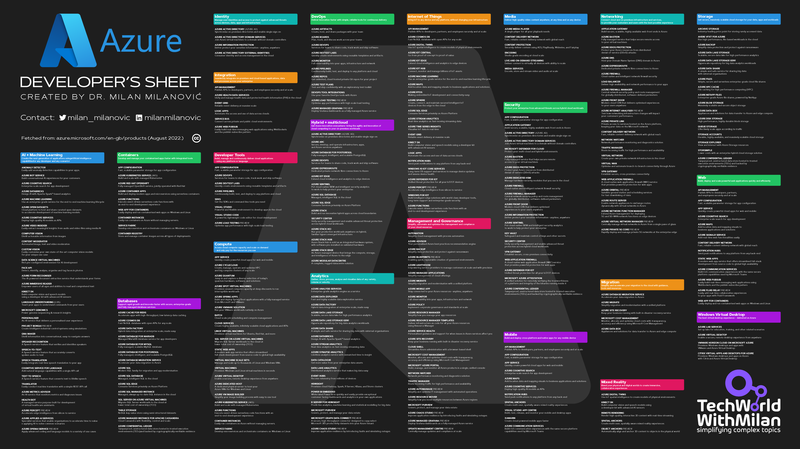
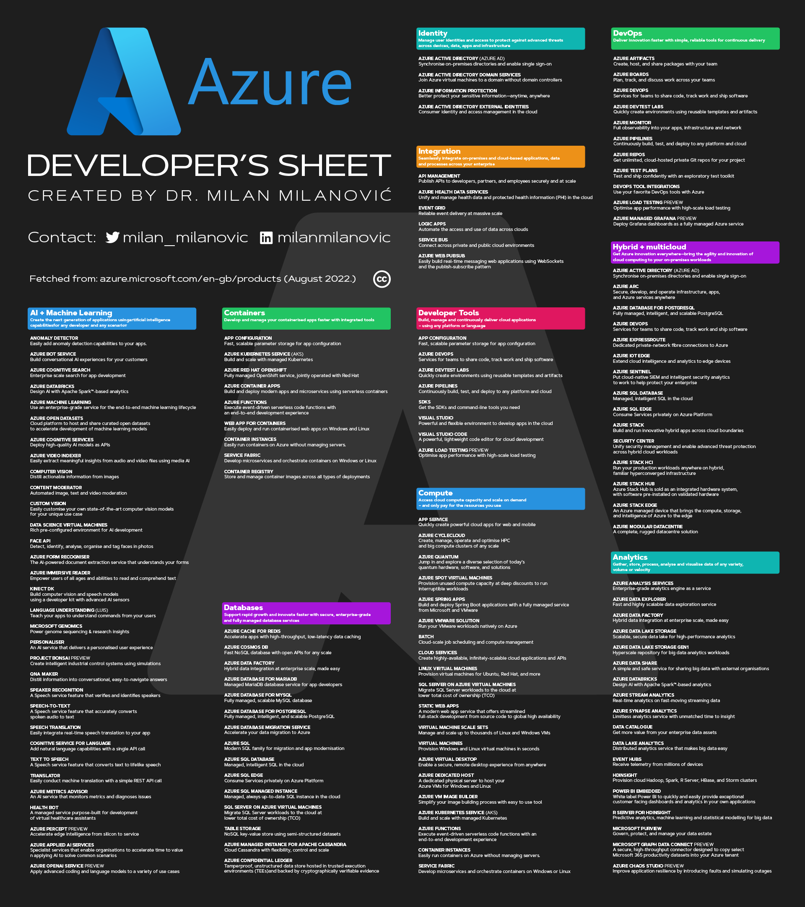
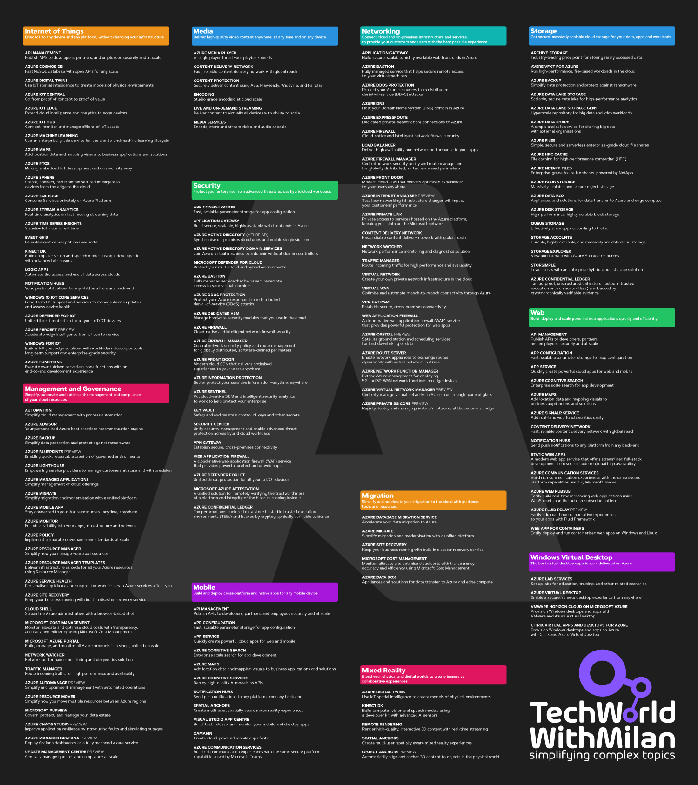
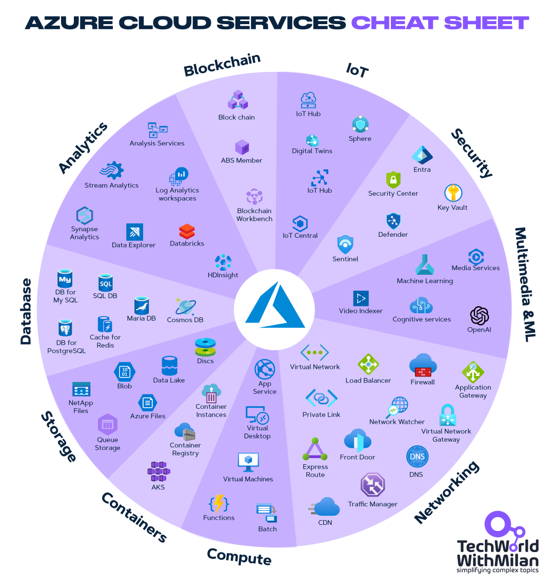

# The Microsoft Azure Developer's Cheat Sheet

Every product, feature and service in the Azure family.

Fetched from: https://azure.microsoft.com/en-gb/products/ (Last update May 2024.).

## Support My Work

If you find this repository helpful, consider supporting me on Patreon:

## Give a Star! :star:

If you like or are using this project to learn or start your solution, please give it a star. Thanks!

Here are the downloadable versions:

## One page version

**White background**:
[High-resolution PNG](1_page_version/LightSheet/Azure_developers_sheet_light-high_rez.png)
|
[Medium-res PNG](1_page_version/LightSheet/Azure_developers_sheet_light-mid_rez.png)
|
[PDF](1_page_version/LightSheet/Azure_Developers_sheet-light.pdf)
|
[SVG](1_page_version/LightSheet/Azure_Developers_sheet-light.svg)

**Dark background**:
[High-resolution PNG](1_page_version/DarkSheet/Azure_developers_sheet_dark-high_rez.png)
|
[Medium-res PNG](1_page_version/DarkSheet/Azure_developers_sheet_dark-mid_rez.png)
|
[PDF](1_page_version/DarkSheet/Azure_Developers_sheet-dark.pdf)
|
[SVG](1_page_version/DarkSheet/Azure_Developers_sheet-dark.svg)

## Two page version

&nbsp; &nbsp; &nbsp; &nbsp;
  

**White background**:

High-resolution PNG: [Page 1.](2_page_version/LightSheet/High/Azure-document-light-1st-page-highrez.png) 
|
[Page 2.](2_page_version/LightSheet/High/Azure-document-light-2nd-page-highrez.png)

Medium-res PNG: [Page 1.](2_page_version/LightSheet/Mid/Azure-document-light-1st-page-mid-rez.png)
|
[Page 2.](2_page_version/LightSheet/Mid/Azure-document-light-2nd-page-mid-rez.png)

Low-res PNG: [Page 1.](2_page_version/LightSheet/Low/Azure-document-light-1st-page-low-rez.png)
| 
[Page 2.](2_page_version/LightSheet/Low/Azure-document-light-2nd-page-low-rez.png)

Other formats: [PDF](2_page_version/LightSheet/Azure_Developers_2_page_sheet_light.pdf)
|
[SVG](2_page_version/LightSheet/Azure_Developers_2_page_sheet_light.svg)

**Dark background**:

High-resolution PNG: [Page 1.](2_page_version/DarkSheet/High/Azure-document-dark-1st-page-highrez.png)
|
[Page 2.](2_page_version/DarkSheet/High/Azure-document-dark-2nd-page-highrez.png)

Medium-res PNG: [Page 1.](2_page_version/DarkSheet/Mid/Azure-document-dark-1st-page-mid_rez.png)
|
[Page 2.](2_page_version/DarkSheet/Mid/Azure-document-dark-2nd-page-mid_rez.png)

Low-res PNG: [Page 1.](2_page_version/DarkSheet/Low/Azure-document-dark-1st-page-low_rez.png)
|
[Page 2.](2_page_version/DarkSheet/Low/Azure-document-dark-2nd-page-low_rez.png)

Other formats: [PDF](2_page_version/DarkSheet/Azure_Developers_2_page_sheet_dark.pdf)
|
[SVG](2_page_version/DarkSheet/Azure_Developers_2_page_sheet_dark.svg)

## Bonus: Azure Cloud Services Cheat Sheet

Download the cheat sheet in the [PDF version](Аzure-Cloud-Services-cheat-sheet.pdf).

## Bonus 2: Azure Load Balancer Cheat Sheet

Download the cheat sheet in the [PDF version](Azure-load-balancer-cheat-sheet.pdf).

Text descriptions with links are below.

----------------------------

# All Products 

## [**Compute**](https://azure.microsoft.com/en-gb/products/category/compute/)

### Access cloud compute capacity and scale on demand – and only pay for the resources you use

* [**App Service**](https://azure.microsoft.com/en-gb/services/app-service/): Quickly create powerful cloud apps for web and mobile.
* [**Azure Quantum**](https://azure.microsoft.com/en-gb/services/quantum/): Jump in and explore a diverse selection of today's quantum hardware, software, and solutions.
* [**Azure Spring Apps**](https://azure.microsoft.com/en-gb/services/spring-apps/): Build and deploy Spring Boot applications with a fully managed service from Microsoft and VMware.
* [**Batch**](https://azure.microsoft.com/en-gb/services/batch/): Cloud-scale job scheduling and compute management.
* [**Linux Virtual Machines**](https://azure.microsoft.com/en-gb/services/virtual-machines/linux-and-open/): Provision virtual machines for Ubuntu, Red Hat, and more.
* [**Static Web Apps**](https://azure.microsoft.com/en-gb/services/app-service/static/): A modern web app service that offers streamlined full-stack development from source code to global high availability.
* [**Virtual Machines**](https://azure.microsoft.com/en-gb/services/virtual-machines/): Provision Windows and Linux virtual machines in seconds.
* [**Azure Dedicated Host**](https://azure.microsoft.com/en-gb/services/virtual-machines/dedicated-host/): A dedicated physical server to host your Azure VMs for Windows and Linux.
* [**Azure Kubernetes Service (AKS)**](https://azure.microsoft.com/en-gb/services/kubernetes-service/): Build and scale with managed Kubernetes.
* [**Container Instances**](https://azure.microsoft.com/en-gb/services/container-instances/): Easily run containers on Azure without managing servers.
* [**Azure CycleCloud**](https://azure.microsoft.com/en-gb/features/azure-cyclecloud/): Create, manage, operate and optimise HPC and big compute clusters of any scale.
* [**Azure Spot Virtual Machines**](https://azure.microsoft.com/en-gb/services/virtual-machines/spot/): Provision unused compute capacity at deep discounts to run interruptible workloads.
* [**Azure VMware Solution**](https://azure.microsoft.com/en-gb/services/azure-vmware/): Run your VMware workloads natively on Azure.
* [**Cloud Services**](https://azure.microsoft.com/en-gb/services/cloud-services/): Create highly-available, infinitely-scalable cloud applications and APIs.
* [**SQL Server on Azure Virtual Machines**](https://azure.microsoft.com/en-gb/services/virtual-machines/sql-server/): Migrate SQL Server workloads to the cloud at lower total cost of ownership (TCO).
* [**Virtual Machine Scale Sets**](https://azure.microsoft.com/en-gb/services/virtual-machine-scale-sets/): Manage and scale up to thousands of Linux and Windows VMs.
* [**Azure Virtual Desktop**](https://azure.microsoft.com/en-gb/services/virtual-desktop/): Enable a secure, remote desktop experience from anywhere.
* [**Azure VM Image Builder**](https://azure.microsoft.com/en-gb/services/image-builder/): Simplify your image building process with easy to use tool.
* [**Azure functions**](https://azure.microsoft.com/en-gb/services/functions/): Execute event-driven serverless code functions with an end-to-end development experience.
* [**Service Fabric**](https://azure.microsoft.com/en-gb/services/service-fabric/): Develop microservices and orchestrate containers on Windows or Linux.
* [**Azure Modeling and Simulation Workbench**](https://azure.microsoft.com/en-gb/products/modeling-and-simulation-workbench): A collaborative on-demand, secure workspace for research and engineering projects.
* [**Azure Compute Fleet**](https://go.microsoft.com/fwlink/?linkid=2270035&clcid=0x809): Easily provision and manage Azure compute capacity at scale.

## [**AI + Machine Learning**](https://azure.microsoft.com/en-gb/overview/ai-platform/)

### Create the next generation of applications using artificial intelligence capabilities for any developer and any scenario

* [**Anomaly Detector**](https://azure.microsoft.com/en-gb/services/cognitive-services/anomaly-detector/): Easily add anomaly detection capabilities to your apps.
* [**Azure Cognitive Search**](https://azure.microsoft.com/en-gb/services/search/): Enterprise scale search for app development.
* [**Azure Machine Learning**](https://azure.microsoft.com/en-gb/services/machine-learning/): Use an enterprise-grade service for the end-to-end machine learning lifecycle.
* [**Azure Cognitive Services**](https://azure.microsoft.com/en-gb/services/cognitive-services/): Deploy high-quality AI models as APIs.
* [**Computer Vision**](https://azure.microsoft.com/en-gb/services/cognitive-services/computer-vision/): Distill actionable information from images.
* [**Custom Vision**](https://azure.microsoft.com/en-gb/services/cognitive-services/custom-vision-service/): asily customise your own state-of-the-art computer vision models for your unique use case.
* [**Face API**](https://azure.microsoft.com/en-gb/services/cognitive-services/face/): Detect, identify, analyse, organise and tag faces in photos.
* [**Azure Immersive Reader**](https://azure.microsoft.com/en-gb/services/immersive-reader/): Empower users of all ages and abilities to read and comprehend text.
* [**Language Understanding (LUIS)**](https://docs.microsoft.com/en-gb/azure/cognitive-services/luis/what-is-luis): Teach your apps to understand commands from your users.
* [**Personaliser**](https://azure.microsoft.com/en-gb/services/cognitive-services/personalizer/): An AI service that delivers a personalised user experience.
* [**QnA Maker**](https://docs.microsoft.com/en-gb/azure/cognitive-services/QnAMaker/Overview/overview): Distill information into conversational, easy-to-navigate answers.
* [**Speech-to-Text**](https://azure.microsoft.com/en-gb/services/cognitive-services/speech-to-text/): A Speech service feature that accurately converts spoken audio to text.
* [**Cognitive Service for Language**](https://azure.microsoft.com/en-gb/services/cognitive-services/language-service/): Add natural language capabilities with a single API call.
* [**Translator**](https://azure.microsoft.com/en-gb/services/cognitive-services/translator/): Easily conduct machine translation with a simple REST API call.
* [**Health Bot**](https://azure.microsoft.com/en-gb/services/bot-services/health-bot/): A managed service purpose-built for development of virtual healthcare assistants.
* [**Azure Applied AI Services**](https://aka.ms/ScalerHomepage): Specialist services that enable organisations to accelerate time to value in applying AI to solve common scenarios.
* [**Azure Bot Service**](https://azure.microsoft.com/en-gb/services/bot-services/): Build conversational AI experiences for your customers.
* [**Azure Databricks**](https://azure.microsoft.com/en-gb/services/databricks/): Design AI with Apache Spark™-based analytics.
* [**Azure Open Datasets**](https://azure.microsoft.com/en-gb/services/open-datasets/): Cloud platform to host and share curated open datasets to accelerate development of machine learning models.
* [**Azure Video Indexer**](https://azure.microsoft.com/en-gb/products/#:~:text=models%20as%20APIs-,Azure%20Video%20Indexer,-Easily%20extract%20meaningful): Easily extract meaningful insights from audio and video files using media AI.
* [**Content moderator**](https://azure.microsoft.com/en-gb/products/#:~:text=information%20from%20images-,Content%20moderator,-Automated%20image%2C%20text): Automated image, text and video moderation.
* [**Data Science Virtual Machines**](https://azure.microsoft.com/en-gb/services/virtual-machines/data-science-virtual-machines/): Rich pre-configured environment for AI development.
* [**Azure Form Recogniser**](https://azure.microsoft.com/en-gb/services/form-recognizer/): The AI-powered document extraction service that understands your forms.
* [**Kinect DK**](https://azure.microsoft.com/en-gb/services/kinect-dk/): Build computer vision and speech models using a developer kit with advanced AI sensors.
* [**Microsoft Genomics**](https://azure.microsoft.com/en-gb/services/genomics/): Power genome sequencing & research insights.
* [**Project Bonsai PREVIEW**](https://azure.microsoft.com/en-gb/services/project-bonsai/): Create intelligent industrial control systems using simulations.
* [**Speaker Recognition**](https://azure.microsoft.com/en-gb/services/cognitive-services/speaker-recognition/): A Speech service feature that verifies and identifies speakers.
* [**Speech translation**](https://azure.microsoft.com/en-gb/services/cognitive-services/speech-translation/): Easily integrate real-time speech translation to your app.
* [**Text to Speech**](https://azure.microsoft.com/en-gb/services/cognitive-services/text-to-speech/): A Speech service feature that converts text to lifelike speech.
* [**Azure Metrics Advisor**](https://azure.microsoft.com/en-gb/services/metrics-advisor/): An AI service that monitors metrics and diagnoses issues.
* [**Azure OpenAI Service**](https://azure.microsoft.com/en-gb/products/ai-services/openai-service/): Apply advanced coding and language models to a variety of use cases.
* [**Azure AI Metrics Advisor**](https://azure.microsoft.com/en-gb/products/ai-services/ai-metrics-advisor/): An AI service that monitors metrics and diagnoses issues.
* [**Azure AI Translator**](https://azure.microsoft.com/en-gb/products/ai-services/ai-translator/): Easily conduct machine translation with a simple REST API call.
* [**Azure AI Personalizer**](https://azure.microsoft.com/en-gb/products/ai-services/ai-personalizer/): Deliver personalized, relevant experiences for each of your users.
* [**Azure AI Content Safety**](https://azure.microsoft.com/en-gb/products/ai-services/ai-content-safety/): Automated image, text, and video moderation.
* [**Azure AI Document Intelligence**](https://azure.microsoft.com/en-gb/products/ai-services/ai-document-intelligence/): A managed service purpose-built for development of virtual healthcare assistants.
* [**Azure AI Studio**](https://azure.microsoft.com/en-gb/products/ai-studio): A platform for developing generative AI solutions and custom copilots.
* [**Microsoft Copilot for Security**](https://www.microsoft.com/en-gb/security/business/ai-machine-learning/microsoft-security-copilot): Protect at the speed and scale of AI with a generative AI-powered assistant.

## [**Analytics**](https://azure.microsoft.com/en-gb/products/category/analytics/)

### Gather, store, process, analyse and visualise data of any variety, volume or velocity

* [**Azure Analysis Services**](https://azure.microsoft.com/en-gb/services/analysis-services/): Enterprise-grade analytics engine as a service.
* [**Azure Data Factory**](https://azure.microsoft.com/en-gb/services/data-factory/): Hybrid data integration at enterprise scale, made easy.
* [**Azure Data Lake Storage Gen1**](https://azure.microsoft.com/en-gb/services/storage/data-lake-storage/): Hyperscale repository for big data analytics workloads.
* [**Azure Databricks**](https://azure.microsoft.com/en-gb/services/databricks/): Design AI with Apache Spark™-based analytics
* [**Azure Synapse Analytics**](https://azure.microsoft.com/en-gb/services/synapse-analytics/): Limitless analytics service with unmatched time to insight.
* [**Data Lake Analytics**](https://azure.microsoft.com/en-gb/services/data-lake-analytics/): Distributed analytics service that makes big data easy.
* [**HDInsight**](https://azure.microsoft.com/en-gb/services/hdinsight/): Provision cloud Hadoop, Spark, R Server, HBase, and Storm clusters.
* [**R Server for HDInsight**](https://azure.microsoft.com/en-gb/services/hdinsight/r-server/): Predictive analytics, machine learning and statistical modelling for big data.
* [**Microsoft Graph Data Connect PREVIEW**](https://azure.microsoft.com/en-gb/services/graph-data-connect/): A secure, high-throughput connector designed to copy select Microsoft 365 productivity datasets into your Azure tenant.
* [**Azure Data Explorer**](https://azure.microsoft.com/en-gb/services/data-explorer/): Fast and highly scalable data exploration service.
* [**Azure Data Lake Storage**](https://azure.microsoft.com/en-gb/services/storage/data-lake-storage/): Scalable, secure data lake for high-performance analytics.
* [**Azure Data Share**](https://azure.microsoft.com/en-gb/services/data-share/): A simple and safe service for sharing big data with external organisations.
* [**Azure Stream Analytics**](https://azure.microsoft.com/en-gb/services/stream-analytics/): Real-time analytics on fast-moving streaming data.
* [**Data Catalogue**](https://azure.microsoft.com/en-gb/services/data-catalog/): Get more value from your enterprise data assets.
* [**Event Hubs**](https://azure.microsoft.com/en-gb/services/event-hubs/): Receive telemetry from millions of devices.
* [**Power BI Embedded**](https://azure.microsoft.com/en-gb/services/power-bi-embedded/): White label Power BI to quickly and easily provide exceptional customer facing dashboards and analytics in your own applications.
* [**Microsoft Purview**](https://azure.microsoft.com/en-gb/services/purview/): Govern, protect, and manage your data estate.
* [**Azure Chaos Studio**](https://azure.microsoft.com/en-gb/products/chaos-studio/): Improve application resilience by introducing faults and simulating outages.

## [**Containers**](https://azure.microsoft.com/en-gb/product-categories/containers/)

### Develop and manage your containerised apps faster with integrated tools

* [**App Configuration**](https://azure.microsoft.com/en-gb/services/app-configuration/): Fast, scalable parameter storage for app configuration.
* [**Azure Red Hat OpenShift**](https://azure.microsoft.com/en-gb/services/openshift/): Fully managed OpenShift service, jointly operated with Red Hat.
* [**Azure functions**](https://azure.microsoft.com/en-gb/services/functions/): Execute event-driven serverless code functions with an end-to-end development experience.
* [**Container Instances**](https://azure.microsoft.com/en-gb/services/container-instances/): Easily run containers on Azure without managing servers..
* [**Container Registry**](https://azure.microsoft.com/en-gb/services/container-registry/): Store and manage container images across all types of deployments.
* [**Azure Kubernetes Service (AKS)**](https://azure.microsoft.com/en-gb/services/kubernetes-service/): Build and scale with managed Kubernetes.
* [**Azure Container Apps**](https://azure.microsoft.com/en-gb/services/container-apps/): Build and deploy modern apps and microservices using serverless containers.
* [**Web App for Containers**](https://azure.microsoft.com/en-gb/services/app-service/containers/): Easily deploy and run containerised web apps on Windows and Linux.
* [**Service Fabric**](https://azure.microsoft.com/en-gb/services/service-fabric/): Develop microservices and orchestrate containers on Windows or Linux.

## [**Databases**](https://azure.microsoft.com/en-gb/product-categories/databases/)

### Support rapid growth and innovate faster with secure, enterprise-grade and fully managed database services

* [**Azure Cache for Redis**](https://azure.microsoft.com/en-gb/services/cache/): Accelerate apps with high-throughput, low-latency data caching.
* [**Azure Data Factory**](https://azure.microsoft.com/en-gb/services/data-factory/): Hybrid data integration at enterprise scale, made easy.
* [**Azure Database for MySQL**](https://azure.microsoft.com/en-gb/services/mysql/): Fully managed, scalable MySQL database.
* [**Azure Database Migration Service**](https://azure.microsoft.com/en-gb/services/database-migration/): Accelerate your data migration to Azure.
* [**Azure SQL**](https://azure.microsoft.com/en-gb/products/azure-sql/): The family of SQL cloud databases providing flexible options for application migration, modernisation and development.
  * [**Azure SQL Edge**](https://azure.microsoft.com/en-gb/products/azure-sql/edge/): Small-footprint, edge-optimised SQL database engine with built-in AI.
  * [**Azure SQL Database**](https://azure.microsoft.com/en-gb/products/azure-sql/database/): Managed, intelligent SQL database in the cloud.
  * [**Azure SQL Managed Instance**](https://azure.microsoft.com/en-gb/products/azure-sql/managed-instance/): Managed, always up-to-date SQL instance in the cloud.
* [**Table Storage**](https://azure.microsoft.com/en-gb/services/storage/tables/): NoSQL key-value store using semi-structured datasets.
* [**Azure Confidential Ledger**](https://azure.microsoft.com/en-gb/services/azure-confidential-ledger/): Tamperproof, unstructured data store hosted in trusted execution environments (TEEs) and backed by cryptographically verifiable evidence.
* [**Azure Cosmos DB**](https://azure.microsoft.com/en-gb/services/cosmos-db/): Fast NoSQL database with open APIs for any scale.
* [**Azure Database for MariaDB**](https://azure.microsoft.com/en-gb/services/mariadb/): Managed MariaDB database service for app developers.
* [**Azure Database for PostgreSQL**](https://azure.microsoft.com/en-gb/services/postgresql/): Fully managed, intelligent, and scalable PostgreSQL.
* [**SQL Server on Azure Virtual Machines**](https://azure.microsoft.com/en-gb/services/virtual-machines/sql-server/): Migrate SQL Server workloads to the cloud at lower total cost of ownership (TCO).
* [**Azure Managed Instance for Apache Cassandra**](https://azure.microsoft.com/en-gb/services/managed-instance-apache-cassandra/): Cloud Cassandra with flexibility, control and scale.

## [**Developer Tools**](https://azure.microsoft.com/en-gb/product-categories/developer-tools/)

### Build, manage and continuously deliver cloud applications – using any platform or language

* [**App Configuration**](https://azure.microsoft.com/en-gb/services/app-configuration/): Fast, scalable parameter storage for app configuration.
* [**Azure DevTest Labs**](https://azure.microsoft.com/en-gb/services/devtest-lab/): Quickly create environments using reusable templates and artifacts.
* [**SDKs**](https://azure.microsoft.com/en-gb/downloads/): Get the SDKs and command-line tools you need.
* [**Visual Studio Code**](https://azure.microsoft.com/en-gb/products/visual-studio-code/): A powerful, lightweight code editor for cloud development.
* [**Azure DevOps**](https://azure.microsoft.com/en-gb/services/devops/): Services for teams to share code, track work and ship software.
* [**Azure Pipelines**](https://azure.microsoft.com/en-gb/services/devops/pipelines/): Continuously build, test, and deploy to any platform and cloud.
* [**Visual Studio**](https://azure.microsoft.com/en-gb/products/visual-studio/): Powerful and flexible environment to develop apps in the cloud.
* [**Azure Load Testing PREVIEW**](https://azure.microsoft.com/en-gb/services/load-testing/): Optimise app performance with high-scale load testing.

## [**DevOps**](https://azure.microsoft.com/en-gb/products/category/devops/)

### Deliver innovation faster with simple, reliable tools for continuous delivery

* [**Azure Artifacts**](https://azure.microsoft.com/en-gb/services/devops/artifacts/): Create, host, and share packages with your team.
* [**Azure Boards**](https://azure.microsoft.com/en-gb/services/devops/boards/): Plan, track, and discuss work across your teams.
* [**Azure DevOps**](https://azure.microsoft.com/en-gb/services/devops/): Services for teams to share code, track work and ship software.
* [**Azure DevTest Labs**](https://azure.microsoft.com/en-gb/services/devtest-lab/): Quickly create environments using reusable templates and artifacts.
* [**Azure Monitor**](https://azure.microsoft.com/en-gb/services/monitor/): Full observability into your apps, infrastructure and network.
* [**Azure Pipelines**](https://azure.microsoft.com/en-gb/services/devops/pipelines/): Continuously build, test, and deploy to any platform and cloud.
* [**Azure Repos**](https://azure.microsoft.com/en-gb/services/devops/repos/): Get unlimited, cloud-hosted private Git repos for your project.
* [**Azure Test Plans**](https://azure.microsoft.com/en-gb/services/devops/test-plans/): Test and ship confidently with an exploratory test toolkit.
* [**DevOps tool integrations**](https://azure.microsoft.com/en-gb/products/devops-tool-integrations/): Use your favorite DevOps tools with Azure.
* [**Azure Load Testing PREVIEW**](https://azure.microsoft.com/en-gb/services/load-testing/): Optimise app performance with high-scale load testing.
* [**Azure Managed Grafana PREVIEW**](https://azure.microsoft.com/en-gb/services/managed-grafana/): Deploy Grafana dashboards as a fully managed Azure service.

## [**Hybrid + multicloud**](https://azure.microsoft.com/en-gb/solutions/hybrid-cloud-app/)

### Get Azure innovation everywhere—bring the agility and innovation of cloud computing to your on-premises workloads

* [**Azure Active Directory (Azure AD)**](https://azure.microsoft.com/en-gb/services/active-directory/): Synchronise on-premises directories and enable single sign-on.
* [**Azure Database for PostgreSQL**](https://azure.microsoft.com/en-gb/services/postgresql/): Fully managed, intelligent, and scalable PostgreSQL.
* [**Azure ExpressRoute**](https://azure.microsoft.com/en-gb/services/expressroute/): edicated private-network fibre connections to Azure.
* [**Azure Sentinel**](https://azure.microsoft.com/en-gb/services/microsoft-sentinel/): Put cloud-native SIEM and intelligent security analytics to work to help protect your enterprise.
* [**Azure SQL Edge**](https://azure.microsoft.com/en-gb/products/azure-sql/edge/): Small-footprint, edge-optimised SQL database engine with built-in AI.
* [**Security Center**](https://azure.microsoft.com/en-gb/services/security-center/): Unify security management and enable advanced threat protection across hybrid cloud workloads.
* [**Azure Stack Hub**](https://azure.microsoft.com/en-gb/products/azure-stack/hub/): Azure Stack Hub is sold as an integrated hardware system, with software pre-installed on validated hardware.
* [**Azure Modular Datacentre**](https://azure.microsoft.com/en-gb/products/azure-modular-datacenter/): A complete, rugged datacentre solution.
* [**Azure Arc**](https://azure.microsoft.com/en-gb/services/azure-arc/): Secure, develop, and operate infrastructure, apps, and Azure services anywhere.
* [**Azure DevOps**](https://azure.microsoft.com/en-gb/services/devops/): Services for teams to share code, track work and ship software.
* [**Azure IoT Edge**](https://azure.microsoft.com/en-gb/services/iot-edge/): Extend cloud intelligence and analytics to edge devices.
* [**Azure SQL Database**](https://azure.microsoft.com/en-gb/products/azure-sql/database/): Managed, intelligent SQL database in the cloud.
* [**Azure Stack**](https://azure.microsoft.com/en-gb/overview/azure-stack/): Build and run innovative hybrid apps across cloud boundaries.
* [**Azure Stack HCI**](https://azure.microsoft.com/en-gb/products/azure-stack/hci/): Run your production workloads anywhere on hybrid, familiar hyperconverged infrastructure.
* [**Azure Stack Edge**](https://azure.microsoft.com/en-gb/products/azure-stack/edge/): An Azure managed device that brings the compute, storage, and intelligence of Azure to the edge.

## [**Identity**](https://azure.microsoft.com/en-gb/products/category/identity/)

### Manage user identities and access to protect against advanced threats across devices, data, apps and infrastructure

* [**Azure Active Directory (Azure AD)**](https://azure.microsoft.com/en-gb/services/active-directory/): Synchronise on-premises directories and enable single sign-on.
* [**Azure Information Protection**](https://azure.microsoft.com/en-gb/services/information-protection/): Better protect your sensitive information—anytime, anywhere.
* [**Azure Active Directory Domain Services**](https://azure.microsoft.com/en-gb/services/active-directory-ds/): Join Azure virtual machines to a domain without domain controllers .
* [**Azure Active Directory External Identities**](https://azure.microsoft.com/en-gb/services/active-directory/external-identities/): Consumer identity and access management in the cloud.

## [**Integration**](https://azure.microsoft.com/en-gb/products/category/integration/)

### Seamlessly integrate on-premises and cloud-based applications, data and processes across your enterprise

* [**API Management**](https://azure.microsoft.com/en-gb/services/api-management/): Publish APIs to developers, partners, and employees securely and at scale.
* [**Event Grid**](https://azure.microsoft.com/en-gb/services/event-grid/): Reliable event delivery at massive scale.
* [**Service Bus**](https://azure.microsoft.com/en-gb/services/service-bus/): Connect across private and public cloud environments.
* [**Azure Health Data Services**](https://azure.microsoft.com/en-gb/services/healthcare-apis/): Unify and manage health data and protected health information (PHI) in the cloud.
* [**Logic Apps**](https://azure.microsoft.com/en-gb/services/logic-apps/): Automate the access and use of data across clouds.
* [**Azure web PubSub**](https://azure.microsoft.com/en-gb/services/web-pubsub/): Easily build real-time messaging web applications using WebSockets and the publish-subscribe pattern.

## [**Internet of Things**](https://azure.microsoft.com/en-gb/overview/iot/)

### Bring IoT to any device and any platform, without changing your infrastructure

* [**API Management**](https://azure.microsoft.com/en-gb/services/api-management/): Publish APIs to developers, partners, and employees securely and at scale.
* [**Azure Digital Twins**](https://azure.microsoft.com/en-gb/services/digital-twins/): Use IoT spatial intelligence to create models of physical environments.
* [**Azure IoT Edge**](https://azure.microsoft.com/en-gb/services/iot-edge/): Extend cloud intelligence and analytics to edge devices.
* [**Azure Machine Learning**](https://azure.microsoft.com/en-gb/services/machine-learning/): Use an enterprise-grade service for the end-to-end machine learning lifecycle.
* [**Azure RTOS**](https://azure.microsoft.com/en-gb/services/rtos/): Making embedded IoT development and connectivity easy.
* [**Azure SQL Edge**](https://azure.microsoft.com/en-gb/products/azure-sql/edge/): Small-footprint, edge-optimised SQL database engine with built-in AI.
* [**Azure Time Series Insights**](https://azure.microsoft.com/en-gb/services/time-series-insights/): Visualise IoT data in real time.
* [**Kinect DK**](https://azure.microsoft.com/en-gb/services/kinect-dk/): Build computer vision and speech models using a developer kit with advanced AI sensors.
* [**Notification Hubs**](https://azure.microsoft.com/en-gb/services/notification-hubs/): Send push notifications to any platform from any back-end.
* [**Azure Defender for IoT**](https://azure.microsoft.com/en-gb/services/azure-defender-for-iot/): Unified threat protection for all your IoT/OT devices.
* [**Windows for IoT**](https://azure.microsoft.com/en-gb/services/windows-iot/): Build intelligent edge solutions with world-class developer tools, long-term support and enterprise-grade security..
* [**Azure Cosmos DB**](https://azure.microsoft.com/en-gb/services/cosmos-db/): Fast NoSQL database with open APIs for any scale.
* [**Azure IoT Central**](https://azure.microsoft.com/en-gb/services/iot-central/): Go from proof of concept to proof of value.
* [**Azure IoT Hub**](https://azure.microsoft.com/en-gb/services/iot-hub/): Connect, monitor and manage billions of IoT assets.
* [**Azure Maps**](https://azure.microsoft.com/en-gb/services/azure-maps/): Add location data and mapping visuals to business applications and solutions.
* [**Azure Sphere**](https://azure.microsoft.com/en-gb/services/azure-sphere/): Create, connect, and maintain secured intelligent IoT devices from the edge to the cloud.
* [**Azure Stream Analytics**](https://azure.microsoft.com/en-gb/services/stream-analytics/): Real-time analytics on fast-moving streaming data.
* [**Event Grid**](https://azure.microsoft.com/en-gb/services/event-grid/): Reliable event delivery at massive scale.
* [**Logic Apps**](https://azure.microsoft.com/en-gb/services/logic-apps/): Automate the access and use of data across clouds.
* [**Windows 10 IoT Core Services**](https://azure.microsoft.com/en-gb/services/windows-10-iot-core/): Long-term OS support and services to manage device updates and assess device health.
* [**Azure Percept PREVIEW**](https://azure.microsoft.com/en-gb/services/azure-percept/): Accelerate edge intelligence from silicon to service.
* [**Azure functions**](https://azure.microsoft.com/en-gb/services/functions/): Execute event-driven serverless code functions with an end-to-end development experience.

## [**Management and Governance**](https://azure.microsoft.com/en-gb/products/category/management/)

### Simplify, automate and optimise the management and compliance of your cloud resources

* [**Automation**](https://azure.microsoft.com/en-gb/services/automation/): Simplify cloud management with process automation.
* [**Azure Backup**](https://azure.microsoft.com/en-gb/services/backup/): Simplify data protection and protect against ransomware.
* [**Azure Lighthouse**](https://azure.microsoft.com/en-gb/services/azure-lighthouse/): Empowering service providers to manage customers at scale and with precision.
* [**Azure Migrate**](https://azure.microsoft.com/en-gb/services/azure-migrate/): Simplify migration and modernisation with a unified platform.
* [**Azure Monitor**](https://azure.microsoft.com/en-gb/services/monitor/): Full observability into your apps, infrastructure and network.
* [**Azure Resource Manager**](https://azure.microsoft.com/en-gb/features/resource-manager/): Simplify how you manage your app resources.
* [**Azure Service Health**](https://azure.microsoft.com/en-gb/features/service-health/): Personalised guidance and support for when issues in Azure services affect you.
* [**Cloud Shell**](https://azure.microsoft.com/en-gb/features/cloud-shell/): Streamline Azure administration with a browser-based shell.
* [**Microsoft Azure portal**](https://azure.microsoft.com/en-gb/features/azure-portal/): Build, manage, and monitor all Azure products in a single, unified console.
* [**Traffic Manager**](https://azure.microsoft.com/en-gb/services/traffic-manager/): Route incoming traffic for high performance and availability.
* [**Azure Resource Mover**](https://azure.microsoft.com/en-gb/services/resource-mover/): Simplify how you move multiple resources between Azure regions.
* [**Azure Chaos Studio PREVIEW**](https://azure.microsoft.com/en-gb/services/chaos-studio/): Improve application resilience by introducing faults and simulating outages.
* [**Update management centre PREVIEW**](https://azure.microsoft.com/en-gb/services/azure-update-management-center/): Centrally manage updates and compliance at scale.
* [**Azure Advisor**](https://azure.microsoft.com/en-gb/services/advisor/): Your personalised Azure best practices recommendation engine.
* [**Azure Blueprints PREVIEW**](https://azure.microsoft.com/en-gb/services/blueprints/): Enabling quick, repeatable creation of governed environments.
* [**Azure Managed Applications**](https://azure.microsoft.com/en-gb/services/managed-applications/): Simplify management of cloud offerings.
* [**Azure mobile app**](https://azure.microsoft.com/en-gb/features/azure-portal/mobile-app/): Stay connected to your Azure resources—anytime, anywhere.
* [**Azure Policy**](https://azure.microsoft.com/en-gb/services/azure-policy/): Implement corporate governance and standards at scale.
* [**Azure Resource Manager templates**](https://azure.microsoft.com/en-gb/services/arm-templates/): Deliver infrastructure as code for all your Azure resources using Resource Manager.
* [**Azure Site Recovery**](https://azure.microsoft.com/en-gb/services/site-recovery/): Keep your business running with built-in disaster recovery service.
* [**Microsoft Cost Management**](https://azure.microsoft.com/en-gb/services/cost-management/): Monitor, allocate and optimise cloud costs with transparency, accuracy and efficiency using Microsoft Cost Management.
* [**Network Watcher**](https://azure.microsoft.com/en-gb/services/network-watcher/): Network performance monitoring and diagnostics solution.
* [**Azure Automanage PREVIEW**](https://azure.microsoft.com/en-gb/services/azure-automanage/): Simplify and optimise IT management with automated operations.
* [**Microsoft Purview**](https://azure.microsoft.com/en-gb/products/purview/): Govern, protect, and manage your data estate.
* [**Azure Managed Grafana PREVIEW**](https://azure.microsoft.com/en-gb/services/managed-grafana/): Deploy Grafana dashboards as a fully managed Azure service.
  
## **Media**

### Deliver high-quality video content anywhere, at any time and on any device

* [**Azure Media Player**](https://azure.microsoft.com/en-gb/services/media-services/media-player/): A single player for all your playback needs.
* [**Content Protection**](https://azure.microsoft.com/en-gb/services/media-services/content-protection/): Securely deliver content using AES, PlayReady, Widevine, and Fairplay.
* [**Live and On-Demand Streaming**](https://azure.microsoft.com/en-gb/services/media-services/live-on-demand/): Deliver content to virtually all devices with ability to scale.
* [**Content Delivery Network**](https://azure.microsoft.com/en-gb/services/cdn/): Fast, reliable content delivery network with global reach.
* [**Encoding**](https://azure.microsoft.com/en-gb/services/media-services/encoding/): Studio grade encoding at cloud scale.
* [**Media Services**](https://azure.microsoft.com/en-gb/services/media-services/): Encode, store and stream video and audio at scale.

## [**Migration**](https://azure.microsoft.com/en-gb/migration/)

### Simplify and accelerate your migration to the cloud with guidance, tools and resources

* [**Azure Database Migration Service**](https://azure.microsoft.com/en-gb/services/database-migration/): Accelerate your data migration to Azure.
* [**Azure Site Recovery**](https://azure.microsoft.com/en-gb/services/site-recovery/): Keep your business running with built-in disaster recovery service.
* [**Azure Data Box**](https://azure.microsoft.com/en-gb/services/databox/): Appliances and solutions for data transfer to Azure and edge compute.
* [**Azure Migrate**](https://azure.microsoft.com/en-gb/services/azure-migrate/): Simplify migration and modernisation with a unified platform.
* [**Microsoft Cost Management**](https://azure.microsoft.com/en-gb/services/cost-management/): Monitor, allocate and optimise cloud costs with transparency, accuracy and efficiency using Microsoft Cost Management.

## [**Mixed Reality**](https://azure.microsoft.com/en-gb/topic/mixed-reality/) 

### Blend your physical and digital worlds to create immersive, collaborative experiences

* [**Azure Digital Twins**](https://azure.microsoft.com/en-gb/services/digital-twins/): Use IoT spatial intelligence to create models of physical environments.
* [**Remote Rendering**](https://azure.microsoft.com/en-gb/services/remote-rendering/): Render high-quality, interactive 3D content with real-time streaming.
* [**Object Anchors PREVIEW**](https://azure.microsoft.com/en-gb/services/object-anchors/): Automatically align and anchor 3D content to objects in the physical world.
* [**Kinect DK**](https://azure.microsoft.com/en-gb/services/kinect-dk/): Build computer vision and speech models using a developer kit with advanced AI sensors.
* [**Spatial Anchors**](https://azure.microsoft.com/en-gb/services/spatial-anchors/): Create multi-user, spatially aware mixed reality experiences.

## [**Mobile**](https://azure.microsoft.com/en-gb/products/category/mobile/)

### Build and deploy cross-platform and native apps for any mobile device

* [**API Management**](https://azure.microsoft.com/en-gb/services/api-management/): Publish APIs to developers, partners, and employees securely and at scale.
* [**App Service**](https://azure.microsoft.com/en-gb/services/app-service/): Quickly create powerful cloud apps for web and mobile.
* [**Azure Maps**](https://azure.microsoft.com/en-gb/services/azure-maps/): Add location data and mapping visuals to business applications and solutions.
* [**Notification Hubs**](https://azure.microsoft.com/en-gb/services/notification-hubs/): Send push notifications to any platform from any back-end.
* [**Visual Studio App Centre**](https://azure.microsoft.com/en-gb/services/app-center/): Build, test, release, and monitor your mobile and desktop apps.
* [**Azure Communication Services**](https://azure.microsoft.com/en-gb/services/communication-services/): Build rich communication experiences with the same secure platform capabilities used by Microsoft Teams.
* [**App Configuration**](https://azure.microsoft.com/en-gb/services/app-configuration/): Fast, scalable parameter storage for app configuration.
* [**Azure Cognitive Search**](https://azure.microsoft.com/en-gb/services/search/): Enterprise scale search for app development.
* [**Azure Cognitive Services**](https://azure.microsoft.com/en-gb/services/cognitive-services/): Deploy high-quality AI models as APIs.  
* [**Spatial Anchors**](https://azure.microsoft.com/en-gb/services/spatial-anchors/): Create multi-user, spatially aware mixed reality experiences.
* [**Xamarin**](https://azure.microsoft.com/en-gb/features/xamarin/): Create cloud-powered mobile apps faster.
  
## [**Networking**](https://azure.microsoft.com/en-gb/products/category/networking/)

### Connect cloud and on-premises infrastructure and services, to provide your customers and users with the best possible experience

* [**Application Gateway**](https://azure.microsoft.com/en-gb/services/application-gateway/): Build secure, scalable, highly available web front ends in Azure.
* [**Azure DDoS Protection**](https://azure.microsoft.com/en-gb/services/ddos-protection/): Protect your Azure resources from distributed denial-of-service (DDoS) attacks.
* [**Azure ExpressRoute**](https://azure.microsoft.com/en-gb/services/expressroute/): Dedicated private-network fibre connections to Azure.
* [**Load Balancer**](https://azure.microsoft.com/en-gb/products/azure-load-balancing/): Deliver high availability and network performance to your apps.
* [**Azure Front Door**](https://azure.microsoft.com/en-gb/services/frontdoor/): Modern cloud CDN that delivers optimised experiences to your users anywhere.
* [**Azure Private Link**](https://azure.microsoft.com/en-gb/services/private-link/): Private access to services hosted on the Azure platform, keeping your data on the Microsoft network.
* [**Network Watcher**](https://azure.microsoft.com/en-gb/services/network-watcher/): Network performance monitoring and diagnostics solution.
* [**Virtual Network**](https://azure.microsoft.com/en-gb/services/virtual-network/): infrastructure in the cloud.
* [**VPN Gateway**](https://azure.microsoft.com/en-gb/services/vpn-gateway/): Establish secure, cross-premises connectivity.
* [**Azure Orbital PREVIEW**](https://azure.microsoft.com/en-gb/services/orbital/): Satellite ground station and scheduling services for fast downlinking of data.
* [**Azure Network Function Manager**](https://azure.microsoft.com/en-gb/products/azure-network-function-manager/): Extend Azure management for deploying 5G and SD-WAN network functions on edge devices.
* [**Azure Private 5G Core PREVIEW**](https://azure.microsoft.com/en-gb/services/private-5g-core/): Rapidly deploy and manage private 5G networks at the enterprise edge.
* [**Azure Bastion**](https://azure.microsoft.com/en-gb/services/azure-bastion/): Fully managed service that helps secure remote access to your virtual machines.
* [**Azure DNS**](https://azure.microsoft.com/en-gb/services/dns/): Host your Domain Name System (DNS) domain in Azure.
* [**Azure Firewall**](https://azure.microsoft.com/en-gb/services/azure-firewall/): Cloud-native and intelligent network firewall security.
* [**Azure Firewall Manager**](https://azure.microsoft.com/en-gb/services/firewall-manager/): Central network security policy and route management for globally distributed, software-defined perimeters.
* [**Azure Internet Analyser PREVIEW**](https://azure.microsoft.com/en-gb/services/internet-analyzer/): Test how networking infrastructure changes will impact your customers' performance..
* [**Content Delivery Network**](https://azure.microsoft.com/en-gb/services/cdn/): Fast, reliable content delivery network with global reach.
* [**Traffic Manager**](https://azure.microsoft.com/en-gb/services/traffic-manager/): Route incoming traffic for high performance and availability.
* [**Virtual WAN**](https://azure.microsoft.com/en-gb/services/virtual-wan/): Optimise and automate branch-to-branch connectivity through Azure.
* [**Web Application Firewall**](https://azure.microsoft.com/en-gb/services/web-application-firewall/): A cloud-native web application firewall (WAF) service that provides powerful protection for web apps.
* [**Azure Route Server**](https://azure.microsoft.com/en-gb/services/route-server/): Enable network appliances to exchange routes dynamically with virtual networks in Azure.
* [**Azure Virtual Network Manager PREVIEW**](https://azure.microsoft.com/en-gb/services/virtual-network-manager/): Centrally manage virtual networks in Azure from a single pane of glass.

## [**Security**](https://azure.microsoft.com/en-gb/products/category/security/)

### Protect your enterprise from advanced threats across hybrid cloud workloads

* [**App Configuration**](https://azure.microsoft.com/en-gb/services/app-configuration/): Fast, scalable parameter storage for app configuration.
* [**Azure Active Directory (Azure AD)**](https://azure.microsoft.com/en-gb/services/active-directory/): Synchronise on-premises directories and enable single sign-on.
* [**Microsoft Defender for Cloud**](https://azure.microsoft.com/en-gb/services/defender-for-cloud/): Protect your multi-cloud and hybrid environments.
* [**Azure DDoS Protection**](https://azure.microsoft.com/en-gb/services/ddos-protection/): Protect your Azure resources from distributed denial-of-service (DDoS) attacks.
* [**Azure Firewall**](https://azure.microsoft.com/en-gb/services/azure-firewall/): Cloud-native and intelligent network firewall security.
* [**Azure Front Door**](https://azure.microsoft.com/en-gb/services/frontdoor/): Modern cloud CDN that delivers optimised experiences to your users anywhere.
* [**Azure Sentinel**](https://azure.microsoft.com/en-gb/services/microsoft-sentinel/): Put cloud-native SIEM and intelligent security analytics to work to help protect your enterprise.
* [**Security Center**](https://azure.microsoft.com/en-gb/services/security-center/): Unify security management and enable advanced threat protection across hybrid cloud workloads.
* [**Web Application Firewall**](https://azure.microsoft.com/en-gb/services/web-application-firewall/): A cloud-native web application firewall (WAF) service that provides powerful protection for web apps.
* [**Microsoft Azure Attestation**](https://azure.microsoft.com/en-gb/services/azure-attestation/): A unified solution for remotely verifying the trustworthiness of a platform and integrity of the binaries running inside it.
* [**Application Gateway**](https://azure.microsoft.com/en-gb/services/application-gateway/): Build secure, scalable, highly available web front ends in Azure.
* [**Azure Active Directory Domain Services**](https://azure.microsoft.com/en-gb/services/active-directory-ds/): Join Azure virtual machines to a domain without domain controllers.
* [**Azure Bastion**](https://azure.microsoft.com/en-gb/services/azure-bastion/): Fully managed service that helps secure remote access to your virtual machines.
* [**Azure Dedicated HSM**](https://azure.microsoft.com/en-gb/services/azure-dedicated-hsm/): Manage hardware security modules that you use in the cloud.
* [**Azure Firewall Manager**](https://azure.microsoft.com/en-gb/services/firewall-manager/): Central network security policy and route management for globally distributed, software-defined perimeters.
* [**Azure Information Protection**](https://azure.microsoft.com/en-gb/services/information-protection/): Better protect your sensitive information—anytime, anywhere.
* [**Key Vault**](https://azure.microsoft.com/en-gb/services/key-vault/): Safeguard and maintain control of keys and other secrets.
* [**VPN Gateway**](https://azure.microsoft.com/en-gb/services/vpn-gateway/): Establish secure, cross-premises connectivity.
* [**Azure Defender for IoT**](https://azure.microsoft.com/en-gb/services/azure-defender-for-iot/): Unified threat protection for all your IoT/OT devices.
* [**Azure Confidential Ledger**](https://azure.microsoft.com/en-gb/services/azure-confidential-ledger/): Tamperproof, unstructured data store hosted in trusted execution environments (TEEs) and backed by cryptographically verifiable evidence.

## [**Storage**](https://azure.microsoft.com/en-gb/products/category/storage/)

### Get secure, massively scalable cloud storage for your data, apps and workloads

* [**Archive Storage**](https://azure.microsoft.com/en-gb/services/storage/archive/): Industry-leading price point for storing rarely accessed data.
* [**Azure Backup**](https://azure.microsoft.com/en-gb/services/backup/): Simplify data protection and protect against ransomware.
* [**Azure Data Lake Storage Gen1**](https://azure.microsoft.com/en-gb/services/storage/data-lake-storage/): Hyperscale repository for big data analytics workloads.
* [**Azure Files**](https://azure.microsoft.com/en-gb/services/storage/files/): Simple, secure and serverless enterprise-grade cloud file shares.
* [**Azure NetApp Files**](https://azure.microsoft.com/en-gb/services/netapp/): Enterprise-grade Azure file shares, powered by NetApp.
* [**Azure Data Box**](https://azure.microsoft.com/en-gb/services/databox/): Appliances and solutions for data transfer to Azure and edge compute.
* [**Queue Storage**](https://azure.microsoft.com/en-gb/services/storage/queues/): Effectively scale apps according to traffic.
* [**Storage Explorer**](https://azure.microsoft.com/en-gb/features/storage-explorer/): View and interact with Azure Storage resources.
* [**Azure Confidential Ledger**](https://azure.microsoft.com/en-gb/services/azure-confidential-ledger/): Tamperproof, unstructured data store hosted in trusted execution environments (TEEs) and backed by cryptographically verifiable evidence.
* [**Avere vFXT for Azure**](https://azure.microsoft.com/en-gb/services/storage/avere-vfxt/): Run high-performance, file-based workloads in the cloud.
* [**Azure Data Lake Storage**](https://azure.microsoft.com/en-gb/services/storage/data-lake-storage/): Scalable, secure data lake for high-performance analytics.
* [**Azure Data Share**](https://azure.microsoft.com/en-gb/services/data-share/): A simple and safe service for sharing big data with external organisations.
* [**Azure HPC Cache**](https://azure.microsoft.com/en-gb/services/hpc-cache/): File caching for high-performance computing (HPC).
* [**Azure Blob Storage**](https://azure.microsoft.com/en-gb/services/storage/blobs/): Massively scalable and secure object storage.
* [**Azure Disk Storage**](https://azure.microsoft.com/en-gb/services/storage/disks/): High-performance, highly durable block storage.
* [**Storage Accounts**](https://azure.microsoft.com/en-gb/services/storage/): Durable, highly available, and massively scalable cloud storage.
* [**StorSimple**](https://azure.microsoft.com/en-gb/services/storsimple/): Lower costs with an enterprise hybrid cloud storage solution.

## [**Web**](https://azure.microsoft.com/en-gb/products/category/web/)

### Build, deploy and scale powerful web applications quickly and efficiently

* [**API Management**](https://azure.microsoft.com/en-gb/services/api-management/): Publish APIs to developers, partners, and employees securely and at scale.
* [**App Service**](https://azure.microsoft.com/en-gb/services/app-service/): Quickly create powerful cloud apps for web and mobile.
* [**Azure Maps**](https://azure.microsoft.com/en-gb/services/azure-maps/): Add location data and mapping visuals to business applications and solutions.
* [**Content Delivery Network**](https://azure.microsoft.com/en-gb/services/cdn/): Fast, reliable content delivery network with global reach.
* [**Static Web Apps**](https://azure.microsoft.com/en-gb/services/app-service/static/): A modern web app service that offers streamlined full-stack development from source code to global high availability.
* [**Azure web PubSub**](https://azure.microsoft.com/en-gb/services/web-pubsub/): Easily build real-time messaging web applications using WebSockets and the publish-subscribe pattern.
* [**Web App for Containers**](https://azure.microsoft.com/en-gb/services/app-service/containers/): Easily deploy and run containerised web apps on Windows and Linux.
* [**App Configuration**](https://azure.microsoft.com/en-gb/services/app-configuration/): Fast, scalable parameter storage for app configuration.
* [**Azure Cognitive Search**](https://azure.microsoft.com/en-gb/services/search/): Enterprise scale search for app development.
* [**Azure SignalR Service**](https://azure.microsoft.com/en-gb/services/signalr-service/): Add real-time web functionalities easily.
* [**Notification Hubs**](https://azure.microsoft.com/en-gb/services/notification-hubs/): Send push notifications to any platform from any back-end.
* [**Azure Communication Services**](https://azure.microsoft.com/en-gb/services/communication-services/): uild rich communication experiences with the same secure platform capabilities used by Microsoft Teams.
* [**Azure Fluid Relay PREVIEW**](https://azure.microsoft.com/en-gb/services/fluid-relay/): Easily add real-time collaborative experiences to your apps with Fluid Framework.

## **Windows Virtual Desktop**

### The best virtual desktop experience – delivered on Azure

* [**Azure Lab Services**](https://azure.microsoft.com/en-gb/services/lab-services/): Set up labs for education, training, and other related scenarios.
* [**VMware Horizon Cloud on Microsoft Azure**](https://azure.microsoft.com/en-gb/services/virtual-desktop/vmware-horizon-cloud/): Provision Windows desktops and apps with VMware and Azure Virtual Desktop.
* [**Azure Virtual Desktop**](https://azure.microsoft.com/en-gb/services/virtual-desktop/): Enable a secure, remote desktop experience from anywhere.
* [**Citrix Virtual Apps and Desktops for Azure**](https://azure.microsoft.com/en-gb/services/virtual-desktop/citrix-virtual-apps-desktops-for-azure/): Provision Windows desktops and apps on Azure with Citrix and Azure Virtual Desktop.

### Additional Resources

* [**Awesome Azure - A Curated List of Azure Resources**](https://github.com/kristofferandreasen/awesome-azure).
* [**Awesome Azure Architecture**](https://github.com/lukemurraynz/awesome-azure-architecture).
* [**Awesome Azure SQL resources**](https://github.com/yorek/awesome-azure-sql).

## Wrap Up

If you think the roadmap can be improved, please do open a PR with any updates and submit any issues. Also, I will continue to improve this, so you might want to star this repository to revisit.

## Contribution

- Open a pull request with improvements
- Discuss ideas in issues
- Spread the word

## License

## Authors

- [Dr. Milan Milanović](https://milan.milanovic.org) -  CTO at [3MD](https://3mdinc.com).
