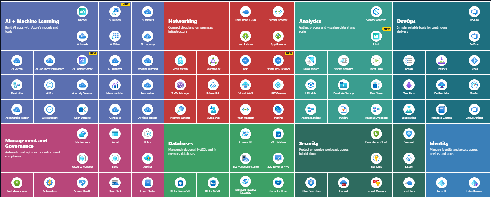
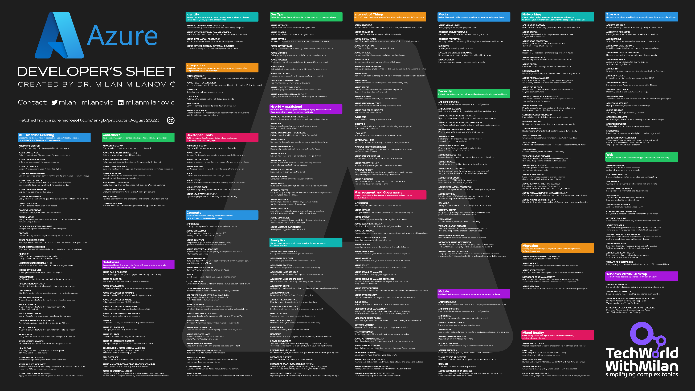
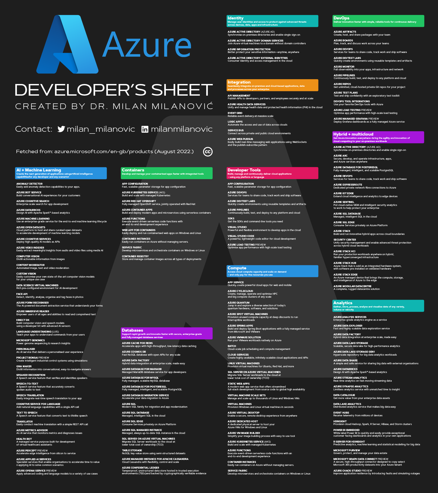
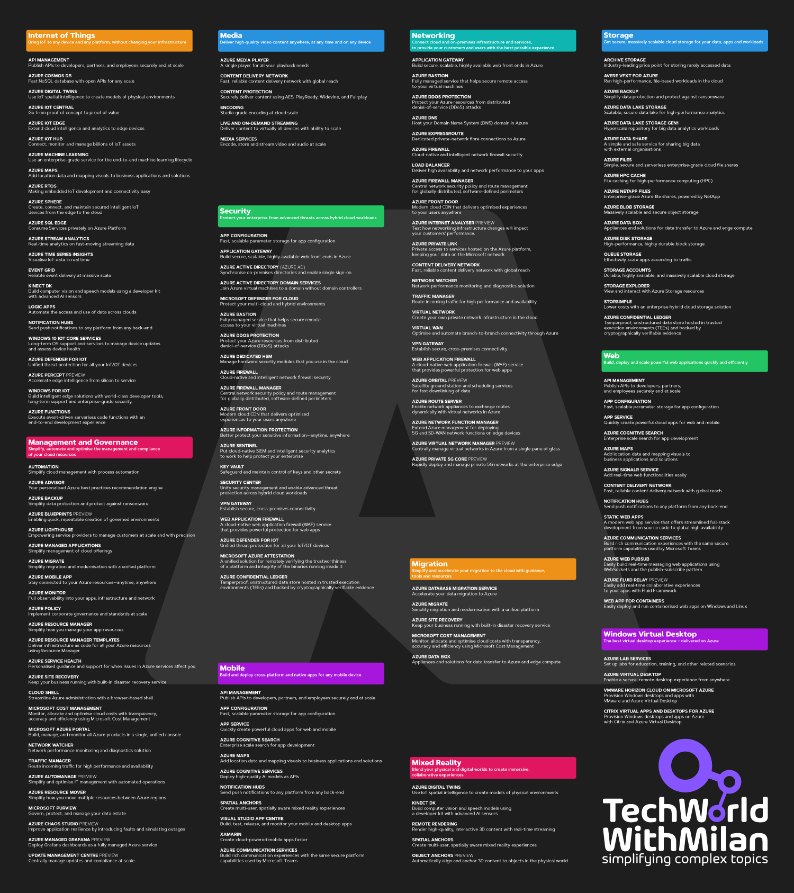
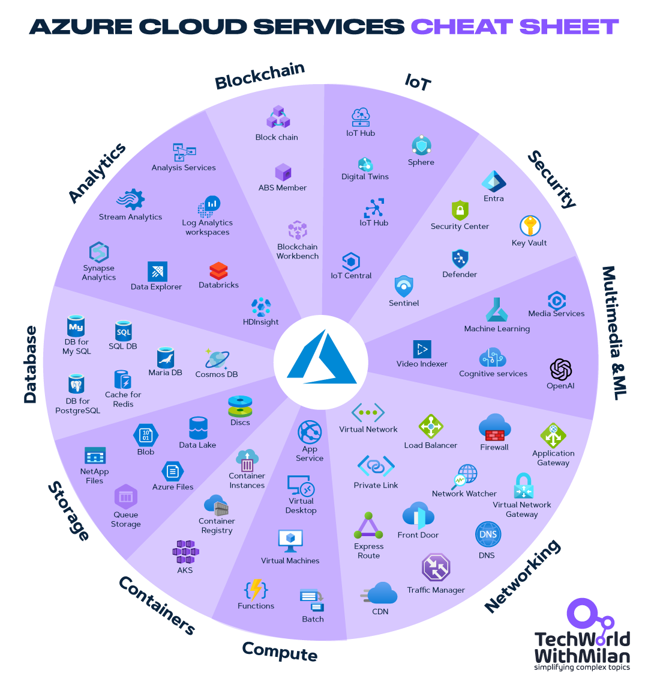
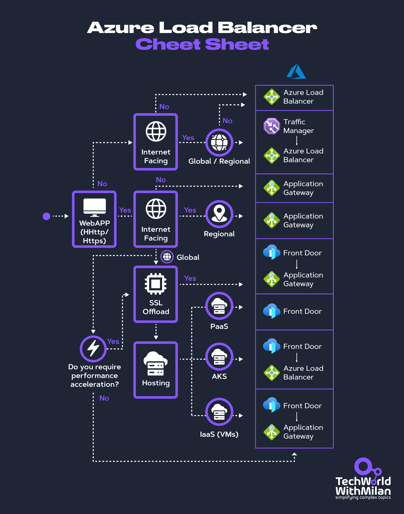

# The Microsoft Azure Developer's Cheat Sheet

Every product, feature and service in the Azure family.

Fetched from: https://azure.microsoft.com/en-gb/products/ (Last update September 5, 2026).

## Support My Work

If you find this repository helpful, consider supporting me on Patreon:

## 🌐 NEW: Interactive Version

Check out the **NEW interactive version** of the cheat sheet:

👉 **[azurecheatsheet.com](https://azurecheatsheet.com)**

---

## Give a Star! :star:

If you like or are using this project to learn or start your solution, please give it a star. Thanks!

Here are the downloadable versions:

## One page version

**White background**:
[High-resolution PNG](1_page_version/LightSheet/Azure_developers_sheet_light-high_rez.png)
|
[Medium-res PNG](1_page_version/LightSheet/Azure_developers_sheet_light-mid_rez.png)
|
[PDF](1_page_version/LightSheet/Azure_Developers_sheet-light.pdf)
|
[SVG](1_page_version/LightSheet/Azure_Developers_sheet-light.svg)

**Dark background**:
[High-resolution PNG](1_page_version/DarkSheet/Azure_developers_sheet_dark-high_rez.png)
|
[Medium-res PNG](1_page_version/DarkSheet/Azure_developers_sheet_dark-mid_rez.png)
|
[PDF](1_page_version/DarkSheet/Azure_Developers_sheet-dark.pdf)
|
[SVG](1_page_version/DarkSheet/Azure_Developers_sheet-dark.svg)

## Two page version

&nbsp; &nbsp; &nbsp; &nbsp;
  

**White background**:

High-resolution PNG: [Page 1.](2_page_version/LightSheet/High/Azure-document-light-1st-page-highrez.png) 
|
[Page 2.](2_page_version/LightSheet/High/Azure-document-light-2nd-page-highrez.png)

Medium-res PNG: [Page 1.](2_page_version/LightSheet/Mid/Azure-document-light-1st-page-mid-rez.png)
|
[Page 2.](2_page_version/LightSheet/Mid/Azure-document-light-2nd-page-mid-rez.png)

Low-res PNG: [Page 1.](2_page_version/LightSheet/Low/Azure-document-light-1st-page-low-rez.png)
| 
[Page 2.](2_page_version/LightSheet/Low/Azure-document-light-2nd-page-low-rez.png)

Other formats: [PDF](2_page_version/LightSheet/Azure_Developers_2_page_sheet_light.pdf)
|
[SVG](2_page_version/LightSheet/Azure_Developers_2_page_sheet_light.svg)

**Dark background**:

High-resolution PNG: [Page 1.](2_page_version/DarkSheet/High/Azure-document-dark-1st-page-highrez.png)
|
[Page 2.](2_page_version/DarkSheet/High/Azure-document-dark-2nd-page-highrez.png)

Medium-res PNG: [Page 1.](2_page_version/DarkSheet/Mid/Azure-document-dark-1st-page-mid_rez.png)
|
[Page 2.](2_page_version/DarkSheet/Mid/Azure-document-dark-2nd-page-mid_rez.png)

Low-res PNG: [Page 1.](2_page_version/DarkSheet/Low/Azure-document-dark-1st-page-low_rez.png)
|
[Page 2.](2_page_version/DarkSheet/Low/Azure-document-dark-2nd-page-low_rez.png)

Other formats: [PDF](2_page_version/DarkSheet/Azure_Developers_2_page_sheet_dark.pdf)
|
[SVG](2_page_version/DarkSheet/Azure_Developers_2_page_sheet_dark.svg)

## Bonus: Azure Cloud Services Cheat Sheet

Download the cheat sheet in the [PDF version](Аzure-Cloud-Services-cheat-sheet.pdf).

## Bonus 2: Azure Load Balancer Cheat Sheet

Download the cheat sheet in the [PDF version](Azure-load-balancer-cheat-sheet.pdf).

Text descriptions with links are below.

----------------------------

# All Products 

## [**Compute**](https://azure.microsoft.com/en-gb/products/category/compute/)

### Access cloud compute capacity and scale on demand – and only pay for the resources you use

* [**App Service**](https://azure.microsoft.com/en-gb/products/app-service/): Quickly create powerful cloud apps for web and mobile.
* [**Azure Quantum**](https://azure.microsoft.com/en-gb/solutions/quantum-computing/): Jump in and explore a diverse selection of today's quantum hardware, software, and solutions.
* [**Batch**](https://azure.microsoft.com/en-gb/products/batch/): Cloud-scale job scheduling and compute management.
* [**Linux Virtual Machines**](https://azure.microsoft.com/en-gb/products/virtual-machines/linux/): Provision virtual machines for Ubuntu, Red Hat, and more.
* [**Static Web Apps**](https://azure.microsoft.com/en-gb/products/app-service/static/): A modern web app service that offers streamlined full-stack development from source code to global high availability.
* [**Virtual Machines**](https://azure.microsoft.com/en-gb/products/virtual-machines/): Provision Windows and Linux virtual machines in seconds.
* [**Azure Confidential VMs**](https://azure.microsoft.com/en-gb/solutions/confidential-compute/): Hardware-based isolation with confidential computing for sensitive workloads.
* [**Azure Dedicated Host**](https://azure.microsoft.com/en-gb/products/virtual-machines/dedicated-host/): A dedicated physical server to host your Azure VMs for Windows and Linux.
* [**Azure Kubernetes Service (AKS)**](https://azure.microsoft.com/en-gb/products/kubernetes-service/): Build and scale with managed Kubernetes.
* [**Container Instances**](https://azure.microsoft.com/en-gb/products/container-instances/): Easily run containers on Azure without managing servers.
* [**Azure CycleCloud**](https://learn.microsoft.com/en-us/azure/cyclecloud/): Create, manage, operate and optimise HPC and big compute clusters of any scale.
* [**Azure Spot Virtual Machines**](https://azure.microsoft.com/en-gb/products/virtual-machines/spot/): Provision unused compute capacity at deep discounts to run interruptible workloads.
* [**Azure VMware Solution**](https://azure.microsoft.com/en-gb/products/azure-vmware/): Run your VMware workloads natively on Azure.
* [**SQL Server on Azure Virtual Machines**](https://azure.microsoft.com/en-gb/products/virtual-machines/sql-server/): Migrate SQL Server workloads to the cloud at lower total cost of ownership (TCO).
* [**Virtual Machine Scale Sets**](https://azure.microsoft.com/en-gb/products/virtual-machine-scale-sets/): Manage and scale up to thousands of Linux and Windows VMs.
* [**Azure Virtual Desktop**](https://azure.microsoft.com/en-gb/products/virtual-desktop/): Enable a secure, remote desktop experience from anywhere.
* [**Azure VM Image Builder**](https://azure.microsoft.com/en-gb/products/image-builder/): Simplify your image building process with easy to use tool.
* [**Azure Functions**](https://azure.microsoft.com/en-gb/products/functions/): Execute event-driven serverless code functions with an end-to-end development experience.
* [**Service Fabric**](https://learn.microsoft.com/en-gb/azure/service-fabric/service-fabric-overview): Develop microservices and orchestrate containers on Windows or Linux.
* [**Azure Modeling and Simulation Workbench**](https://azure.microsoft.com/en-gb/products/modeling-and-simulation-workbench): A collaborative on-demand, secure workspace for research and engineering projects.
* [**Azure Compute Fleet**](https://azure.microsoft.com/en-gb/products/compute-fleet/): Efficiently provision and manage compute resources at scale.
* [**Microsoft Dev Box**](https://azure.microsoft.com/en-gb/products/dev-box/): Cloud-powered developer workstations preconfigured and ready to code.
* [**Azure Deployment Environments**](https://azure.microsoft.com/en-gb/products/deployment-environments/): Quickly spin up app infrastructure environments with project-based templates.
* [**Azure Linux**](https://azure.microsoft.com/en-gb/products/azure-linux/): Microsoft's lightweight, hardened Linux distribution optimised for Azure and AKS workloads.
* [**Nutanix Cloud Clusters on Azure**](https://azure.microsoft.com/en-gb/products/nutanix): Run Nutanix workloads natively on Azure with a consistent hybrid operating model.

## [**AI + Machine Learning**](https://azure.microsoft.com/en-gb/solutions/ai/)

### Create the next generation of applications using artificial intelligence capabilities for any developer and any scenario

* [**Azure OpenAI in Foundry Models**](https://azure.microsoft.com/en-gb/products/ai-foundry/models/openai/): Access foundational and reasoning models, integrate AI agents, and customise with fine-tuning.
* [**Microsoft Foundry**](https://azure.microsoft.com/en-gb/products/ai-foundry): Unified platform for building, optimising, and governing AI apps and agents.
* [**Foundry Agent Service**](https://azure.microsoft.com/en-gb/products/ai-foundry/agent-service): Securely design, deploy, and scale AI agents.
* [**Foundry Tools**](https://azure.microsoft.com/en-gb/products/ai-foundry/tools): Build AI applications with customisable tools, APIs, and models.
* [**Azure AI Search**](https://azure.microsoft.com/en-us/products/ai-services/ai-search): Implement powerful search capabilities within your applications.
* [**Azure Vision in Foundry Tools**](https://azure.microsoft.com/en-gb/products/ai-foundry/tools/vision): Read text, analyse images, and detect faces with optical character recognition.
* [**Azure AI Custom Vision**](https://azure.microsoft.com/en-gb/products/ai-services/ai-custom-vision/): Easily build and deploy custom image classification models.
* [**Azure Language in Foundry Tools**](https://azure.microsoft.com/en-gb/products/ai-foundry/tools/language): Build conversational interfaces, summarise documents, and analyse text.
* [**Azure Translator in Foundry Tools**](https://azure.microsoft.com/en-gb/products/ai-foundry/tools/translator): Translate across 100+ languages in real time with a simple REST API call.
* [**Azure Speech in Foundry Tools**](https://azure.microsoft.com/en-gb/products/ai-foundry/tools/speech): Implement speech-to-text, text-to-speech, and speech translation in your apps.
* [**Azure Document Intelligence in Foundry Tools**](https://azure.microsoft.com/en-gb/products/ai-foundry/tools/document-intelligence): Extract text, key-value pairs, tables, and structure from documents.
* [**Content Safety in Foundry Control Plane**](https://azure.microsoft.com/en-gb/products/ai-foundry/control-plane): Automate the detection and moderation of harmful content across platforms.
* [**Azure AI Video Indexer**](https://azure.microsoft.com/en-us/products/ai-video-indexer/): Extract meaningful metadata from audio and video content.
* [**Azure AI Immersive Reader**](https://azure.microsoft.com/en-gb/products/ai-services/ai-immersive-reader/): Enhance reading and comprehension capabilities in your applications.
* [**Azure AI Bot Service**](https://azure.microsoft.com/en-us/products/ai-services/ai-bot-service): Develop intelligent bots that interact naturally with users.
* [**Foundry Models**](https://azure.microsoft.com/en-gb/products/ai-foundry/models/): Discover, deploy, and manage a wide range of AI models from Microsoft and partners.
* [**Azure Machine Learning**](https://azure.microsoft.com/en-gb/products/machine-learning/): Build, train, and deploy machine learning models at scale.
* [**Azure Databricks**](https://azure.microsoft.com/en-gb/products/databricks/): Collaborative platform for data engineering and machine learning.
* [**Health Bot**](https://learn.microsoft.com/en-us/azure/health-bot/): A managed service purpose-built for development of virtual healthcare assistants.
* [**Data Science Virtual Machines**](https://azure.microsoft.com/en-gb/products/virtual-machines/data-science-virtual-machines/): Rich pre-configured environment for AI development.
* [**Foundry Control Plane**](https://azure.microsoft.com/en-gb/products/ai-foundry/control-plane): Observability, guardrails, policy, and security controls to govern AI apps and agents at enterprise scale.
* [**Foundry IQ**](https://azure.microsoft.com/en-gb/products/ai-foundry/iq/): Agentic retrieval that grounds models and agents in your enterprise knowledge.
* [**Azure Content Understanding in Foundry Tools**](https://azure.microsoft.com/en-gb/products/ai-foundry/tools/content-understanding): Turn unstructured documents, images, audio, and video into structured data.
* [**Microsoft Security Copilot**](https://www.microsoft.com/en-gb/security/business/ai-machine-learning/microsoft-security-copilot): AI assistant that helps security teams investigate and respond to threats at machine speed.
* [**Microsoft Planetary Computer Pro**](https://azure.microsoft.com/en-gb/products/planetary-computer-pro): Manage, catalogue, and analyse geospatial data at scale.
* [**Azure Open Datasets**](https://azure.microsoft.com/en-gb/products/open-datasets/): Curated public datasets to improve model accuracy and shorten data preparation.
* [**Phi open models**](https://azure.microsoft.com/en-gb/products/phi/): Microsoft's family of small language models for efficient cloud and on-device inference.

## [**Analytics**](https://azure.microsoft.com/en-gb/products/category/analytics/)

### Gather, store, process, analyse and visualise data of any variety, volume or velocity

* [**Azure Analysis Services**](https://azure.microsoft.com/en-gb/products/analysis-services/): Enterprise-grade analytics engine as a service.
* [**Azure Data Factory**](https://azure.microsoft.com/en-gb/products/data-factory/): Hybrid data integration at enterprise scale, made easy.
* [**Azure Databricks**](https://azure.microsoft.com/en-gb/products/databricks/): Design AI with Apache Spark™-based analytics.
* [**Azure Synapse Analytics**](https://azure.microsoft.com/en-gb/products/synapse-analytics/): Limitless analytics service with unmatched time to insight.
* [**Microsoft Fabric**](https://www.microsoft.com/en-gb/microsoft-fabric): Unified analytics platform for data engineering, data science, real-time analytics, and business intelligence.
* [**HDInsight**](https://azure.microsoft.com/en-gb/products/hdinsight/): Provision cloud Hadoop, Spark, and other open-source clusters.
* [**Microsoft Graph Data Connect**](https://azure.microsoft.com/en-gb/products/graph-data-connect/): A secure, high-throughput connector designed to copy select Microsoft 365 productivity datasets into your Azure tenant.
* [**Azure Data Explorer**](https://azure.microsoft.com/en-gb/products/data-explorer/): Fast and highly scalable data exploration service.
* [**Azure Data Lake Storage**](https://azure.microsoft.com/en-gb/products/storage/data-lake-storage/): Scalable, secure data lake for high-performance analytics.
* [**Azure Stream Analytics**](https://azure.microsoft.com/en-gb/products/stream-analytics/): Real-time analytics on fast-moving streaming data.
* [**Event Hubs**](https://azure.microsoft.com/en-gb/products/event-hubs/): Receive telemetry from millions of devices.
* [**Power BI Embedded**](https://azure.microsoft.com/en-gb/products/power-bi-embedded/): White label Power BI to quickly and easily provide exceptional customer facing dashboards and analytics in your own applications.
* [**Microsoft Purview**](https://www.microsoft.com/en-gb/security/business/risk-management/microsoft-purview-data-governance/): Govern, protect, and manage your data estate.
* [**Azure Chaos Studio**](https://azure.microsoft.com/en-gb/products/chaos-studio/): Improve application resilience by introducing faults and simulating outages.
* [**Azure Operator Insights**](https://azure.microsoft.com/en-gb/products/operator-insights/): Gain intelligent insights into network operations for enhanced performance.
* [**Azure Data Share**](https://azure.microsoft.com/en-gb/products/data-share/): Simply and securely share big data with external organisations.
* [**Microsoft Planetary Computer Pro**](https://azure.microsoft.com/en-gb/products/planetary-computer-pro): Manage, catalogue, and analyse geospatial data at scale.

## [**Containers**](https://azure.microsoft.com/en-gb/products/category/containers/)

### Develop and manage your containerised apps faster with integrated tools

* [**App Configuration**](https://azure.microsoft.com/en-gb/products/app-configuration/): Fast, scalable parameter storage for app configuration.
* [**Azure Red Hat OpenShift**](https://azure.microsoft.com/en-gb/products/openshift/): Fully managed OpenShift service, jointly operated with Red Hat.
* [**Azure Functions**](https://azure.microsoft.com/en-gb/products/functions/): Execute event-driven serverless code functions with an end-to-end development experience.
* [**Azure Container Instances**](https://azure.microsoft.com/en-gb/products/container-instances/): Easily run containers on Azure without managing servers.
* [**Azure Container Registry**](https://azure.microsoft.com/en-gb/products/container-registry/): Store and manage container images across all types of deployments.
* [**Azure Kubernetes Service (AKS)**](https://azure.microsoft.com/en-gb/products/kubernetes-service/): Build and scale with managed Kubernetes.
* [**Azure Container Apps**](https://azure.microsoft.com/en-gb/products/container-apps/): Build and deploy modern apps and microservices using serverless containers.
* [**Web App for Containers**](https://azure.microsoft.com/en-gb/products/app-service/): Easily deploy and run containerised web apps on Windows and Linux.
* [**Service Fabric**](https://learn.microsoft.com/en-gb/azure/service-fabric/service-fabric-overview): Develop microservices and orchestrate containers on Windows or Linux.
* [**Azure Kubernetes Fleet Manager**](https://azure.microsoft.com/en-gb/products/kubernetes-fleet-manager/): Manage multiple Kubernetes clusters across environments seamlessly.
* [**Azure Container Storage**](https://azure.microsoft.com/en-gb/products/container-storage/): Container-native storage management for stateful workloads on Kubernetes.

## [**Databases**](https://azure.microsoft.com/en-gb/products/category/databases/)

### Support rapid growth and innovate faster with secure, enterprise-grade and fully managed database services

* [**Azure Managed Redis**](https://azure.microsoft.com/en-gb/products/managed-redis): Accelerate app performance with a fully managed, scalable, in-memory solution.
* [**Azure Data Factory**](https://azure.microsoft.com/en-gb/products/data-factory/): Hybrid data integration at enterprise scale, made easy.
* [**Azure Database for MySQL**](https://azure.microsoft.com/en-gb/products/mysql/): Fully managed, scalable MySQL database.
* [**Azure Database Migration Service**](https://azure.microsoft.com/en-gb/products/database-migration/): Accelerate your data migration to Azure.
* [**Azure SQL**](https://azure.microsoft.com/en-gb/products/azure-sql/): The family of SQL cloud databases providing flexible options for application migration, modernisation and development.
  * [**Azure SQL Database**](https://azure.microsoft.com/en-gb/products/azure-sql/database/): Managed, intelligent SQL database in the cloud.
  * [**Azure SQL Managed Instance**](https://azure.microsoft.com/en-gb/products/azure-sql/managed-instance/): Managed, always up-to-date SQL instance in the cloud.
* [**Table Storage**](https://azure.microsoft.com/en-gb/products/storage/tables/): NoSQL key-value store using semi-structured datasets.
* [**Azure Confidential Ledger**](https://azure.microsoft.com/en-gb/products/azure-confidential-ledger/): Tamperproof, unstructured data store hosted in trusted execution environments (TEEs) and backed by cryptographically verifiable evidence.
* [**Azure Cosmos DB**](https://azure.microsoft.com/en-gb/products/cosmos-db/): Fast NoSQL database with open APIs for any scale.
* [**Azure Database for PostgreSQL**](https://azure.microsoft.com/en-gb/products/postgresql/): Fully managed, intelligent, and scalable PostgreSQL with elastic clusters for distributed workloads.
* [**Azure DocumentDB**](https://azure.microsoft.com/en-gb/products/documentdb): Open-source, MongoDB-compatible document database service for hybrid and multicloud architectures.
* [**SQL Server on Azure Virtual Machines**](https://azure.microsoft.com/en-gb/products/virtual-machines/sql-server/): Migrate SQL Server workloads to the cloud at lower total cost of ownership (TCO).
* [**Azure Managed Instance for Apache Cassandra**](https://azure.microsoft.com/en-gb/products/managed-instance-apache-cassandra/): Cloud Cassandra with flexibility, control and scale.
* [**Azure Elastic SAN**](https://azure.microsoft.com/en-gb/products/storage/elastic-san/): Cloud-native storage area network for high-performance block storage at scale.
* [**Azure HorizonDB**](https://azure.microsoft.com/en-gb/products/horizondb): Cloud-native, PostgreSQL-compatible database for mission-critical, high-throughput workloads.

## [**Developer Tools**](https://azure.microsoft.com/en-gb/products/category/developer-tools/)

### Build, manage and continuously deliver cloud applications – using any platform or language

* [**App Configuration**](https://azure.microsoft.com/en-gb/products/app-configuration/): Fast, scalable parameter storage for app configuration.
* [**Azure DevTest Labs**](https://azure.microsoft.com/en-gb/products/devtest-lab/): Quickly create environments using reusable templates and artifacts.
* [**SDKs**](https://azure.microsoft.com/en-gb/downloads/): Get the SDKs and command-line tools you need.
* [**Visual Studio Code**](https://azure.microsoft.com/en-gb/products/visual-studio-code/): A powerful, lightweight code editor for cloud development.
* [**Azure DevOps**](https://azure.microsoft.com/en-gb/products/devops/): Services for teams to share code, track work and ship software.
* [**Azure Pipelines**](https://azure.microsoft.com/en-gb/products/devops/pipelines/): Continuously build, test, and deploy to any platform and cloud.
* [**Visual Studio**](https://azure.microsoft.com/en-gb/products/visual-studio/): Powerful and flexible environment to develop apps in the cloud.
* [**Azure App Testing**](https://azure.microsoft.com/en-gb/products/app-testing/): Unified load testing and Playwright end-to-end testing for web apps at cloud scale.
* [**Microsoft Dev Box**](https://azure.microsoft.com/en-gb/products/dev-box/): Cloud-powered developer workstations preconfigured and ready to code.
* [**Azure Deployment Environments**](https://azure.microsoft.com/en-gb/products/deployment-environments/): Quickly spin up app infrastructure environments with project-based templates.
* [**GitHub Advanced Security for Azure DevOps**](https://azure.microsoft.com/en-gb/products/devops/github-advanced-security/): Code scanning, secret scanning, and dependency scanning for Azure DevOps repos.
* [**Azure API Center**](https://learn.microsoft.com/en-us/azure/api-center/overview): Centralized catalog for discovering, governing, and consuming APIs across your organisation.
* [**Microsoft Playwright Testing**](https://azure.microsoft.com/en-gb/products/playwright-testing): Run Playwright end-to-end browser tests at cloud scale across browsers and operating systems.
* [**Azure Artifact Signing**](https://azure.microsoft.com/en-gb/products/artifact-signing): Fully managed code and artifact signing service, formerly Trusted Signing.

## [**DevOps**](https://azure.microsoft.com/en-gb/products/category/devops/)

### Deliver innovation faster with simple, reliable tools for continuous delivery

* [**Azure Artifacts**](https://azure.microsoft.com/en-gb/products/devops/artifacts/): Create, host, and share packages with your team.
* [**Azure Boards**](https://azure.microsoft.com/en-gb/products/devops/boards/): Plan, track, and discuss work across your teams.
* [**Azure DevOps**](https://azure.microsoft.com/en-gb/products/devops/): Services for teams to share code, track work and ship software.
* [**Azure DevTest Labs**](https://azure.microsoft.com/en-gb/products/devtest-lab/): Quickly create environments using reusable templates and artifacts.
* [**Azure Monitor**](https://azure.microsoft.com/en-gb/products/monitor/): Full observability into your apps, infrastructure and network.
* [**Azure Pipelines**](https://azure.microsoft.com/en-gb/products/devops/pipelines/): Continuously build, test, and deploy to any platform and cloud.
* [**Azure Repos**](https://azure.microsoft.com/en-gb/products/devops/repos/): Get unlimited, cloud-hosted private Git repos for your project.
* [**Azure Test Plans**](https://azure.microsoft.com/en-gb/products/devops/test-plans/): Test and ship confidently with an exploratory test toolkit.
* [**DevOps tool integrations**](https://azure.microsoft.com/en-gb/products/devops/): Use your favorite DevOps tools with Azure.
* [**Azure App Testing**](https://azure.microsoft.com/en-gb/products/app-testing/): Unified load testing and Playwright end-to-end testing for web apps at cloud scale.
* [**Azure Managed Grafana**](https://azure.microsoft.com/en-gb/products/managed-grafana/): Deploy Grafana dashboards as a fully managed Azure service.
* [**Microsoft Playwright Testing**](https://azure.microsoft.com/en-gb/products/playwright-testing): Run Playwright end-to-end browser tests at cloud scale across browsers and operating systems.
* [**Azure SRE Agent**](https://azure.microsoft.com/en-gb/products/sre-agent/): AI-powered operations agent that helps improve uptime, reduce incident impact, and automate response workflows.

## [**Hybrid + multicloud**](https://azure.microsoft.com/en-gb/solutions/adaptive-cloud/)

### Get Azure innovation everywhere—bring the agility and innovation of cloud computing to your on-premises workloads

* [**Microsoft Entra ID**](https://www.microsoft.com/en-gb/security/business/identity-access/microsoft-entra-id): Synchronise on-premises directories and enable single sign-on.
* [**Azure Database for PostgreSQL**](https://azure.microsoft.com/en-gb/products/postgresql/): Fully managed, intelligent, and scalable PostgreSQL.
* [**Azure ExpressRoute**](https://azure.microsoft.com/en-gb/products/expressroute/): Dedicated private-network fibre connections to Azure.
* [**Microsoft Sentinel**](https://www.microsoft.com/en-gb/security/business/siem-and-xdr/microsoft-sentinel-siem): Put cloud-native SIEM and intelligent security analytics to work to help protect your enterprise.
* [**Microsoft Defender for Cloud**](https://www.microsoft.com/en-gb/security/business/cloud-security/microsoft-defender-cloud/): Protect your multi-cloud and hybrid environments.
* [**Azure Stack Hub**](https://azure.microsoft.com/en-gb/products/azure-stack/hub/): Azure Stack Hub is sold as an integrated hardware system, with software pre-installed on validated hardware.
* [**Azure Modular Datacentre**](https://azure.microsoft.com/en-gb/products/azure-modular-datacenter/): A complete, rugged datacentre solution.
* [**Azure Arc**](https://azure.microsoft.com/en-gb/products/azure-arc/): Secure, develop, and operate infrastructure, apps, and Azure services anywhere.
* [**Azure DevOps**](https://azure.microsoft.com/en-gb/products/devops/): Services for teams to share code, track work and ship software.
* [**Azure IoT Edge**](https://azure.microsoft.com/en-gb/products/iot-edge/): Extend cloud intelligence and analytics to edge devices.
* [**Azure SQL Database**](https://azure.microsoft.com/en-gb/products/azure-sql/database/): Managed, intelligent SQL database in the cloud.
* [**Azure Stack Edge**](https://azure.microsoft.com/en-gb/products/azure-stack/edge/): An Azure managed device that brings the compute, storage, and intelligence of Azure to the edge.
* [**Azure Local**](https://azure.microsoft.com/en-gb/products/local/): Run Azure services locally for consistent hybrid cloud experiences.
* [**Azure Operator Nexus**](https://azure.microsoft.com/en-gb/products/operator-nexus/): Carrier-grade hybrid cloud platform for network operators running network-intensive workloads.
* [**Azure Operator Service Manager**](https://azure.microsoft.com/en-gb/products/operator-service-manager/): Deploy and manage network functions consistently across hybrid environments.
* [**Azure Storage Mover**](https://azure.microsoft.com/en-gb/products/storage-mover/): Managed migration service for moving data into Azure Storage from on-premises or other clouds.

## [**Identity**](https://azure.microsoft.com/en-gb/products/category/identity/)

### Manage user identities and access to protect against advanced threats across devices, data, apps and infrastructure

* [**Microsoft Entra ID**](https://www.microsoft.com/en-gb/security/business/identity-access/microsoft-entra-id): Synchronise on-premises directories and enable single sign-on.
* [**Azure Information Protection**](https://www.microsoft.com/en-gb/security/business/data-security-governance/microsoft-purview-data-security): Better protect your sensitive information—anytime, anywhere.
* [**Microsoft Entra Domain Services**](https://azure.microsoft.com/en-gb/products/microsoft-entra-ds): Join Azure virtual machines to a domain without domain controllers.
* [**Microsoft Entra External ID**](https://www.microsoft.com/en-gb/security/business/identity-access/microsoft-entra-external-id): Consumer identity and access management in the cloud.
* [**Microsoft Entra Verified ID**](https://www.microsoft.com/en-gb/security/business/identity-access/microsoft-entra-verified-id): Issue and verify privacy-respecting decentralised digital credentials.

## [**Integration**](https://azure.microsoft.com/en-gb/products/category/integration/)

### Seamlessly integrate on-premises and cloud-based applications, data and processes across your enterprise

* [**API Management**](https://azure.microsoft.com/en-gb/products/api-management/): Publish APIs to developers, partners, and employees securely and at scale.
* [**Event Grid**](https://azure.microsoft.com/en-gb/products/event-grid/): Reliable event delivery at massive scale.
* [**Service Bus**](https://azure.microsoft.com/en-gb/products/service-bus/): Connect across private and public cloud environments.
* [**Azure Health Data Services**](https://azure.microsoft.com/en-gb/products/health-data-services/): Unify and manage health data and protected health information (PHI) in the cloud.
* [**Logic Apps**](https://azure.microsoft.com/en-gb/products/logic-apps/): Automate the access and use of data across clouds.
* [**Azure Web PubSub**](https://azure.microsoft.com/en-gb/products/web-pubsub/): Easily build real-time messaging web applications using WebSockets and the publish-subscribe pattern.
* [**Azure Data Manager for Energy**](https://azure.microsoft.com/en-gb/products/data-manager-for-energy/): Fully managed OSDU™ data platform for energy industry datasets.

## [**Internet of Things**](https://azure.microsoft.com/en-gb/solutions/iot/)

### Bring IoT to any device and any platform, without changing your infrastructure

* [**API Management**](https://azure.microsoft.com/en-gb/products/api-management/): Publish APIs to developers, partners, and employees securely and at scale.
* [**Azure Digital Twins**](https://azure.microsoft.com/en-gb/products/digital-twins/): Use IoT spatial intelligence to create models of physical environments.
* [**Azure IoT Edge**](https://azure.microsoft.com/en-gb/products/iot-edge/): Extend cloud intelligence and analytics to edge devices.
* [**Azure Machine Learning**](https://azure.microsoft.com/en-gb/products/machine-learning/): Use an enterprise-grade service for the end-to-end machine learning lifecycle.
* [**Notification Hubs**](https://azure.microsoft.com/en-gb/products/notification-hubs/): Send push notifications to any platform from any back-end.
* [**Microsoft Defender for IoT**](https://www.microsoft.com/en-gb/security/business/endpoint-security/microsoft-defender-iot): Unified threat protection for all your IoT/OT devices.
* [**Windows for IoT**](https://azure.microsoft.com/en-gb/products/windows-iot/): Build intelligent edge solutions with world-class developer tools, long-term support and enterprise-grade security.
* [**Azure Cosmos DB**](https://azure.microsoft.com/en-gb/products/cosmos-db/): Fast NoSQL database with open APIs for any scale.
* [**Azure IoT Central**](https://azure.microsoft.com/en-gb/products/iot-central/): Go from proof of concept to proof of value.
* [**Azure IoT Hub**](https://azure.microsoft.com/en-gb/products/iot-hub/): Connect, monitor and manage billions of IoT assets.
* [**Azure Maps**](https://azure.microsoft.com/en-gb/products/azure-maps/): Add location data and mapping visuals to business applications and solutions.
* [**Azure Sphere**](https://azure.microsoft.com/en-gb/products/azure-sphere/): Create, connect, and maintain secured intelligent IoT devices from the edge to the cloud.
* [**Azure Stream Analytics**](https://azure.microsoft.com/en-gb/products/stream-analytics/): Real-time analytics on fast-moving streaming data.
* [**Event Grid**](https://azure.microsoft.com/en-gb/products/event-grid/): Reliable event delivery at massive scale.
* [**Logic Apps**](https://azure.microsoft.com/en-gb/products/logic-apps/): Automate the access and use of data across clouds.
* [**Azure Functions**](https://azure.microsoft.com/en-gb/products/functions/): Execute event-driven serverless code functions with an end-to-end development experience.
* [**Azure IoT Operations**](https://azure.microsoft.com/en-gb/products/iot-operations): Adaptive, Arc-enabled data plane for capturing and processing edge asset data on Kubernetes.

## [**Management and Governance**](https://azure.microsoft.com/en-gb/products/category/management/)

### Simplify, automate and optimise the management and compliance of your cloud resources

* [**Automation**](https://azure.microsoft.com/en-gb/products/automation/): Simplify cloud management with process automation.
* [**Azure Copilot**](https://azure.microsoft.com/en-gb/products/copilot/): Harness the collective intelligence of Azure agents with an AI companion.
* [**Azure Backup**](https://azure.microsoft.com/en-gb/products/backup/): Simplify data protection and protect against ransomware.
* [**Azure Lighthouse**](https://azure.microsoft.com/en-gb/products/azure-lighthouse/): Empowering service providers to manage customers at scale and with precision.
* [**Azure Migrate**](https://azure.microsoft.com/en-gb/products/azure-migrate/): Simplify migration and modernisation with a unified platform.
* [**Azure Monitor**](https://azure.microsoft.com/en-gb/products/monitor/): Full observability into your apps, infrastructure and network.
* [**Azure Resource Manager**](https://azure.microsoft.com/en-gb/get-started/azure-portal/resource-manager/): Simplify how you manage your app resources.
* [**Azure Service Health**](https://azure.microsoft.com/en-gb/get-started/azure-portal/service-health/): Personalised guidance and support for when issues in Azure services affect you.
* [**Cloud Shell**](https://azure.microsoft.com/en-gb/get-started/azure-portal/cloud-shell/): Streamline Azure administration with a browser-based shell.
* [**Azure portal**](https://azure.microsoft.com/en-gb/get-started/azure-portal/): Build, manage, and monitor all Azure products in a single, unified console.
* [**Azure Traffic Manager**](https://azure.microsoft.com/en-gb/products/traffic-manager/): Route incoming traffic for high performance and availability.
* [**Azure Resource Mover**](https://azure.microsoft.com/en-gb/products/resource-mover/): Simplify how you move multiple resources between Azure regions.
* [**Azure Chaos Studio**](https://azure.microsoft.com/en-gb/products/chaos-studio/): Improve application resilience by introducing faults and simulating outages.
* [**Azure Update Manager**](https://azure.microsoft.com/en-gb/products/azure-update-management-center/): Centrally govern and manage software updates at scale.
* [**Azure Advisor**](https://azure.microsoft.com/en-gb/products/advisor/): Your personalised Azure best practices recommendation engine.
* [**Azure Policy**](https://azure.microsoft.com/en-gb/products/azure-policy/): Implement corporate governance and standards at scale.
* [**Azure Resource Manager templates**](https://azure.microsoft.com/en-gb/products/arm-templates/): Deliver infrastructure as code for all your Azure resources using Resource Manager.
* [**Azure Site Recovery**](https://azure.microsoft.com/en-gb/products/site-recovery/): Keep your business running with built-in disaster recovery service.
* [**Microsoft Cost Management**](https://azure.microsoft.com/en-gb/products/cost-management/): Monitor, allocate and optimise cloud costs with transparency, accuracy and efficiency using Microsoft Cost Management.
* [**Azure Network Watcher**](https://azure.microsoft.com/en-gb/products/network-watcher/): Network performance monitoring and diagnostics solution.
* [**Microsoft Purview**](https://www.microsoft.com/en-gb/security/business/risk-management/microsoft-purview-data-governance/): Govern, protect, and manage your data estate.
* [**Azure Managed Grafana**](https://azure.microsoft.com/en-gb/products/managed-grafana/): Deploy Grafana dashboards as a fully managed Azure service.
* [**Azure Business Continuity Center**](https://learn.microsoft.com/en-us/azure/business-continuity-center/business-continuity-center-overview): Unified management for backup and disaster recovery across Azure workloads.
* [**Azure SRE Agent**](https://azure.microsoft.com/en-gb/products/sre-agent/): AI-powered operations agent that helps improve uptime, reduce incident impact, and automate response workflows.
* [**Azure Managed Applications**](https://azure.microsoft.com/en-gb/products/managed-applications/): Package and deliver turnkey cloud solutions that customers deploy and you operate.
* [**Azure Automanage**](https://azure.microsoft.com/en-gb/products/azure-automanage/): Automate virtual machine configuration and apply Azure best-practice services.
* [**Defender External Attack Surface Management**](https://azure.microsoft.com/en-gb/products/defender-external-attack-surface-management/): Discover and continuously monitor your internet-facing attack surface.
  
## [**Migration**](https://azure.microsoft.com/en-gb/solutions/migration/)

### Simplify and accelerate your migration to the cloud with guidance, tools and resources

* [**Azure Database Migration Service**](https://azure.microsoft.com/en-gb/products/database-migration/): Accelerate your data migration to Azure.
* [**Azure Site Recovery**](https://azure.microsoft.com/en-gb/products/site-recovery/): Keep your business running with built-in disaster recovery service.
* [**Azure Data Box**](https://azure.microsoft.com/en-gb/products/databox/): Appliances and solutions for data transfer to Azure and edge compute.
* [**Azure Migrate**](https://azure.microsoft.com/en-gb/products/azure-migrate/): Simplify migration and modernisation with a unified platform.
* [**Azure Storage Mover**](https://azure.microsoft.com/en-gb/products/storage-mover/): Managed migration service for moving data into Azure Storage from on-premises or other clouds.
* [**Microsoft Cost Management**](https://azure.microsoft.com/en-gb/products/cost-management/): Monitor, allocate and optimise cloud costs with transparency, accuracy and efficiency using Microsoft Cost Management.

## [**Mixed Reality**](https://azure.microsoft.com/en-gb/solutions/mixed-reality) 

### Blend your physical and digital worlds to create immersive, collaborative experiences

* [**Azure Digital Twins**](https://azure.microsoft.com/en-gb/products/digital-twins/): Use IoT spatial intelligence to create models of physical environments.

## [**Mobile**](https://azure.microsoft.com/en-gb/products/category/mobile/)

### Build and deploy cross-platform and native apps for any mobile device

* [**API Management**](https://azure.microsoft.com/en-gb/products/api-management/): Publish APIs to developers, partners, and employees securely and at scale.
* [**App Service**](https://azure.microsoft.com/en-gb/products/app-service/): Quickly create powerful cloud apps for web and mobile.
* [**Azure Maps**](https://azure.microsoft.com/en-gb/products/azure-maps/): Add location data and mapping visuals to business applications and solutions.
* [**Notification Hubs**](https://azure.microsoft.com/en-gb/products/notification-hubs/): Send push notifications to any platform from any back-end.
* [**Azure Communication Services**](https://azure.microsoft.com/en-gb/products/communication-services/): Build rich communication experiences with the same secure platform capabilities used by Microsoft Teams.
* [**App Configuration**](https://azure.microsoft.com/en-gb/products/app-configuration/): Fast, scalable parameter storage for app configuration.
* [**Azure AI Search**](https://azure.microsoft.com/en-gb/products/ai-services/ai-search/): Enterprise scale search for app development.
* [**Foundry Tools**](https://azure.microsoft.com/en-gb/products/ai-foundry/tools/): Build AI applications with customisable tools, APIs, and models.
  
## [**Networking**](https://azure.microsoft.com/en-gb/products/category/networking/)

### Connect cloud and on-premises infrastructure and services, to provide your customers and users with the best possible experience

* [**Azure Application Gateway**](https://azure.microsoft.com/en-gb/products/application-gateway/): Build secure, scalable, highly available web front ends in Azure.
* [**Azure DDoS Protection**](https://azure.microsoft.com/en-gb/products/ddos-protection/): Protect your Azure resources from distributed denial-of-service (DDoS) attacks.
* [**Azure ExpressRoute**](https://azure.microsoft.com/en-gb/products/expressroute/): Dedicated private-network fibre connections to Azure.
* [**Azure Load Balancer**](https://azure.microsoft.com/en-gb/products/azure-load-balancing/): Deliver high availability and network performance to your apps.
* [**Azure Front Door**](https://azure.microsoft.com/en-gb/products/frontdoor/): Modern cloud CDN that delivers optimised experiences to your users anywhere.
* [**Azure Private Link**](https://azure.microsoft.com/en-gb/products/private-link/): Private access to services hosted on the Azure platform, keeping your data on the Microsoft network.
* [**Azure Network Watcher**](https://azure.microsoft.com/en-gb/products/network-watcher/): Network performance monitoring and diagnostics solution.
* [**Azure Virtual Network**](https://azure.microsoft.com/en-gb/products/virtual-network/): Create your own private network infrastructure in the cloud.
* [**Azure VPN Gateway**](https://azure.microsoft.com/en-gb/products/vpn-gateway/): Establish secure, cross-premises connectivity.
* [**Azure Network Function Manager**](https://azure.microsoft.com/en-gb/products/azure-network-function-manager/): Extend Azure management for deploying 5G and SD-WAN network functions on edge devices.
* [**Azure Bastion**](https://azure.microsoft.com/en-gb/products/azure-bastion/): Fully managed service that helps secure remote access to your virtual machines.
* [**Azure DNS**](https://azure.microsoft.com/en-gb/products/dns/): Host your Domain Name System (DNS) domain in Azure.
* [**Azure Firewall**](https://azure.microsoft.com/en-gb/products/azure-firewall/): Cloud-native and intelligent network firewall security.
* [**Azure Firewall Manager**](https://azure.microsoft.com/en-gb/products/firewall-manager/): Central network security policy and route management for globally distributed, software-defined perimeters.
* [**Azure Content Delivery Network**](https://azure.microsoft.com/en-gb/products/cdn/): Fast, reliable content delivery network with global reach.
* [**Azure Traffic Manager**](https://azure.microsoft.com/en-gb/products/traffic-manager/): Route incoming traffic for high performance and availability.
* [**Azure Virtual WAN**](https://azure.microsoft.com/en-gb/products/virtual-wan/): Optimise and automate branch-to-branch connectivity through Azure.
* [**Azure Web Application Firewall**](https://azure.microsoft.com/en-gb/products/web-application-firewall/): A cloud-native web application firewall (WAF) service that provides powerful protection for web apps.
* [**Azure Route Server**](https://azure.microsoft.com/en-gb/products/route-server/): Enable network appliances to exchange routes dynamically with virtual networks in Azure.
* [**Azure Virtual Network Manager**](https://azure.microsoft.com/en-gb/products/virtual-network-manager/): Centrally manage virtual networks in Azure from a single pane of glass.
* [**Azure Programmable Connectivity**](https://azure.microsoft.com/en-gb/products/programmable-connectivity/): Access network APIs from multiple operators to build applications with enhanced connectivity features.
* [**Azure NAT Gateway**](https://azure.microsoft.com/en-gb/products/azure-nat-gateway/): Simple, secure, and highly scalable outbound connectivity for virtual networks.
* [**Azure Enclave**](https://azure.microsoft.com/en-gb/products/enclave): Create isolated, zero-trust software-defined networks with built-in governance for sensitive workloads.

## [**Security**](https://azure.microsoft.com/en-gb/products/category/security/)

### Protect your enterprise from advanced threats across hybrid cloud workloads

* [**App Configuration**](https://azure.microsoft.com/en-gb/products/app-configuration/): Fast, scalable parameter storage for app configuration.
* [**Microsoft Entra ID**](https://www.microsoft.com/en-gb/security/business/identity-access/microsoft-entra-id): Synchronise on-premises directories and enable single sign-on.
* [**Microsoft Defender for Cloud**](https://www.microsoft.com/en-gb/security/business/cloud-security/microsoft-defender-cloud/): Protect your multi-cloud and hybrid environments.
* [**Azure DDoS Protection**](https://azure.microsoft.com/en-gb/products/ddos-protection/): Protect your Azure resources from distributed denial-of-service (DDoS) attacks.
* [**Azure Firewall**](https://azure.microsoft.com/en-gb/products/azure-firewall/): Cloud-native and intelligent network firewall security.
* [**Azure Front Door**](https://azure.microsoft.com/en-gb/products/frontdoor/): Modern cloud CDN that delivers optimised experiences to your users anywhere.
* [**Microsoft Sentinel**](https://www.microsoft.com/en-gb/security/business/siem-and-xdr/microsoft-sentinel-siem): Put cloud-native SIEM and intelligent security analytics to work to help protect your enterprise.
* [**Azure Web Application Firewall**](https://azure.microsoft.com/en-gb/products/web-application-firewall/): A cloud-native web application firewall (WAF) service that provides powerful protection for web apps.
* [**Microsoft Azure Attestation**](https://azure.microsoft.com/en-gb/products/azure-attestation/): A unified solution for remotely verifying the trustworthiness of a platform and integrity of the binaries running inside it.
* [**Azure Application Gateway**](https://azure.microsoft.com/en-gb/products/application-gateway/): Build secure, scalable, highly available web front ends in Azure.
* [**Microsoft Entra Domain Services**](https://azure.microsoft.com/en-gb/products/microsoft-entra-ds): Join Azure virtual machines to a domain without domain controllers.
* [**Azure Bastion**](https://azure.microsoft.com/en-gb/products/azure-bastion/): Fully managed service that helps secure remote access to your virtual machines.
* [**Azure Cloud HSM**](https://azure.microsoft.com/en-gb/products/cloud-hsm/): Manage hardware security modules that you use in the cloud.
* [**Azure Firewall Manager**](https://azure.microsoft.com/en-gb/products/firewall-manager/): Central network security policy and route management for globally distributed, software-defined perimeters.
* [**Azure Information Protection**](https://www.microsoft.com/en-gb/security/business/data-security-governance/microsoft-purview-data-security): Better protect your sensitive information—anytime, anywhere.
* [**Azure Key Vault**](https://azure.microsoft.com/en-gb/products/key-vault/): Safeguard and maintain control of keys and other secrets.
* [**Azure VPN Gateway**](https://azure.microsoft.com/en-gb/products/vpn-gateway/): Establish secure, cross-premises connectivity.
* [**Microsoft Defender for IoT**](https://www.microsoft.com/en-gb/security/business/endpoint-security/microsoft-defender-iot): Unified threat protection for all your IoT/OT devices.
* [**Azure Confidential Ledger**](https://azure.microsoft.com/en-gb/products/azure-confidential-ledger/): Tamperproof, unstructured data store hosted in trusted execution environments (TEEs) and backed by cryptographically verifiable evidence.
* [**Microsoft Security Copilot**](https://www.microsoft.com/en-gb/security/business/ai-machine-learning/microsoft-security-copilot): AI assistant that helps security teams investigate and respond to threats at machine speed.
* [**Defender External Attack Surface Management**](https://azure.microsoft.com/en-gb/products/defender-external-attack-surface-management/): Discover and continuously monitor your internet-facing attack surface.

## [**Storage**](https://azure.microsoft.com/en-gb/products/category/storage/)

### Get secure, massively scalable cloud storage for your data, apps and workloads

* [**Archive Storage**](https://azure.microsoft.com/en-gb/products/storage/): Industry-leading price point for storing rarely accessed data.
* [**Azure Backup**](https://azure.microsoft.com/en-gb/products/backup/): Simplify data protection and protect against ransomware.
* [**Azure Files**](https://azure.microsoft.com/en-gb/products/storage/files/): Simple, secure and serverless enterprise-grade cloud file shares.
* [**Azure NetApp Files**](https://azure.microsoft.com/en-gb/products/netapp/): Enterprise-grade Azure file shares, powered by NetApp.
* [**Azure Data Box**](https://azure.microsoft.com/en-gb/products/databox/): Appliances and solutions for data transfer to Azure and edge compute.
* [**Queue Storage**](https://azure.microsoft.com/en-gb/products/storage/queues/): Effectively scale apps according to traffic.
* [**Storage Explorer**](https://azure.microsoft.com/en-gb/products/storage/storage-explorer/): View and interact with Azure Storage resources.
* [**Azure Confidential Ledger**](https://azure.microsoft.com/en-gb/products/azure-confidential-ledger/): Tamperproof, unstructured data store hosted in trusted execution environments (TEEs) and backed by cryptographically verifiable evidence.
* [**Azure Data Lake Storage**](https://azure.microsoft.com/en-gb/products/storage/data-lake-storage/): Scalable, secure data lake for high-performance analytics.
* [**Azure Blob Storage**](https://azure.microsoft.com/en-gb/products/storage/blobs/): Massively scalable and secure object storage.
* [**Azure Disk Storage**](https://azure.microsoft.com/en-gb/products/storage/disks/): High-performance, highly durable block storage.
* [**Storage Accounts**](https://azure.microsoft.com/en-gb/products/category/storage/): Durable, highly available, and massively scalable cloud storage.
* [**Azure Managed Lustre**](https://azure.microsoft.com/en-gb/products/managed-lustre/): High-performance parallel file system for HPC and AI workloads.
* [**Azure Container Storage**](https://azure.microsoft.com/en-gb/products/container-storage/): Container-native storage management for stateful workloads on Kubernetes.
* [**Azure Elastic SAN**](https://azure.microsoft.com/en-gb/products/storage/elastic-san/): Cloud-native storage area network for high-performance block storage at scale.
* [**Azure Storage Discovery**](https://azure.microsoft.com/en-gb/products/storage-discovery/): Gain storage visibility and insights to improve data strategy and operations.
* [**Azure Storage Actions**](https://azure.microsoft.com/en-gb/products/storage-actions): Serverless framework to automate data management tasks on blob data at scale.
* [**Azure Storage Mover**](https://azure.microsoft.com/en-gb/products/storage-mover/): Managed migration service for moving data into Azure Storage from on-premises or other clouds.
* [**Azure Data Share**](https://azure.microsoft.com/en-gb/products/data-share/): Simply and securely share big data with external organisations.

## [**Web**](https://azure.microsoft.com/en-gb/products/category/web/)

### Build, deploy and scale powerful web applications quickly and efficiently

* [**API Management**](https://azure.microsoft.com/en-gb/products/api-management/): Publish APIs to developers, partners, and employees securely and at scale.
* [**App Service**](https://azure.microsoft.com/en-gb/products/app-service/): Quickly create powerful cloud apps for web and mobile.
* [**Azure Maps**](https://azure.microsoft.com/en-gb/products/azure-maps/): Add location data and mapping visuals to business applications and solutions.
* [**Azure Content Delivery Network**](https://azure.microsoft.com/en-gb/products/cdn/): Fast, reliable content delivery network with global reach.
* [**Static Web Apps**](https://azure.microsoft.com/en-gb/products/app-service/static/): A modern web app service that offers streamlined full-stack development from source code to global high availability.
* [**Azure Web PubSub**](https://azure.microsoft.com/en-gb/products/web-pubsub/): Easily build real-time messaging web applications using WebSockets and the publish-subscribe pattern.
* [**Web App for Containers**](https://azure.microsoft.com/en-gb/products/app-service/): Easily deploy and run containerised web apps on Windows and Linux.
* [**App Configuration**](https://azure.microsoft.com/en-gb/products/app-configuration/): Fast, scalable parameter storage for app configuration.
* [**Azure AI Search**](https://azure.microsoft.com/en-gb/products/ai-services/ai-search/): Enterprise scale search for app development.
* [**Azure SignalR Service**](https://azure.microsoft.com/en-gb/products/signalr-service/): Add real-time web functionalities easily.
* [**Notification Hubs**](https://azure.microsoft.com/en-gb/products/notification-hubs/): Send push notifications to any platform from any back-end.
* [**Azure Communication Services**](https://azure.microsoft.com/en-gb/products/communication-services/): Build rich communication experiences with the same secure platform capabilities used by Microsoft Teams.
* [**Azure Container Apps**](https://azure.microsoft.com/en-gb/products/container-apps/): Build and deploy modern apps and microservices using serverless containers.
* [**Azure Fluid Relay**](https://azure.microsoft.com/en-gb/products/fluid-relay/): Managed service for building real-time collaborative experiences into your apps.
* [**Microsoft Playwright Testing**](https://azure.microsoft.com/en-gb/products/playwright-testing): Run Playwright end-to-end browser tests at cloud scale across browsers and operating systems.

## **Virtual desktop infrastructure**

### Empower employees to work securely from anywhere with a cloud-based virtual desktop infrastructure

* [**Azure Lab Services**](https://azure.microsoft.com/en-gb/products/lab-services/): Set up labs for education, training, and other related scenarios.
* [**Azure Virtual Desktop**](https://azure.microsoft.com/en-gb/products/virtual-desktop/): Enable a secure, remote desktop experience from anywhere.
* [**Microsoft Dev Box**](https://azure.microsoft.com/en-gb/products/dev-box/): Streamline development with secure, ready-to-code workstations in the cloud.

### Additional Resources

* [**Awesome Azure - A Curated List of Azure Resources**](https://github.com/kristofferandreasen/awesome-azure).
* [**Awesome Azure Architecture**](https://github.com/lukemurraynz/awesome-azure-architecture).
* [**Awesome Azure SQL resources**](https://github.com/yorek/awesome-azure-sql).

## Wrap Up

If you think the roadmap can be improved, please do open a PR with any updates and submit any issues. Also, I will continue to improve this, so you might want to star this repository to revisit.

## Contribution

- Open a pull request with improvements
- Discuss ideas in issues
- Spread the word

## License

## Authors

- [Dr. Milan Milanović](https://milan.milanovic.org) -  CTO at [3MD](https://3mdinc.com).
